# bger reader

**Barrierefreie Bundesgerichtsentscheide für Firefox, Chrome, Brave und Edge.**

[](https://github.com/cursorblinkrate-boop/bger-reader-addon/actions/workflows/release.yml)
[](https://github.com/cursorblinkrate-boop/bger-reader-addon/releases)
[](LICENSE)

> **English summary.** bger reader is a free, open-source accessibility extension for decisions of the Swiss Federal Supreme Court (search.bger.ch, relevancy.bger.ch) and the Swiss Federal Administrative Court (bvger.weblaw.ch). It adds adjustable typography, fonts designed for low vision and dyslexia, colour schemes including dark and night mode, and it folds citations in parentheses out of the way so the court's reasoning stays readable. The interface is available in German, English, French and Italian. It runs entirely offline: no frameworks, no tracking, no external requests, no data collected, transmitted or stored outside your browser. The only browser permission it asks for is `storage`, used to remember your settings.

bger reader ist eine Browser-Erweiterung, die Entscheide des Schweizerischen Bundesgerichts und des Bundesverwaltungsgerichts leichter lesbar macht. Sie verändert nur die Darstellung im eigenen Browser: Schriftart, Schriftgrösse, Abstände, Zeilenlänge, Textbreite und Farbschema lassen sich frei einstellen, und Fundstellen in Klammern wie `(BGE 135 II 45 E. 3.2 S. 47)` werden hinter einem kleinen Pfeil eingeklappt, damit der Gedankengang des Entscheids nicht ständig unterbrochen wird. Der Text bleibt vollständig erhalten, jede Klammer lässt sich mit einem Klick öffnen, und beim Drucken – auch als PDF – erscheint der Entscheid schwarz auf weiss in der gewählten Schrift, die Klammern so, wie sie am Bildschirm sind.

Die Erweiterung arbeitet zu 100 % offline. Sie sendet keine Daten, lädt nichts nach, enthält keine Werbung und keine Statistik. Die einzige Berechtigung, die sie verlangt, ist der lokale Speicher für die eigenen Einstellungen. bger reader ist ein unabhängiges Projekt und weder mit dem Bundesgericht noch mit dem Bundesverwaltungsgericht oder mit Weblaw verbunden.

## Was die Erweiterung kann

- **Schrift:** neun Schriftarten, darunter Atkinson Hyperlegible und Luciole für Menschen mit Sehbeeinträchtigung und OpenDyslexic für Menschen mit Legasthenie; Grösse von 6 bis 50, Schriftstärke normal oder fett.
- **Abstände und Satz:** Zeilen-, Absatz-, Buchstaben- und Wortabstand, Zeilenlänge, Textbreite, Silbentrennung, Ausrichtung, ein bis drei Spalten.
- **Farbschema:** Weiss, Sepia, Dunkel, Hoher Kontrast und ein rötlicher Nachtmodus, jeweils für die ganze Seite.
- **Klammern:** Zitate aus der Rechtsprechung und Literaturangaben werden eingeklappt, Gesetzesverweise und Entscheidtext bleiben offen. Jede Klammer ist einzeln aufklappbar.
- **Bedienung:** ein Einstellungsfeld direkt auf der Seite (pinker Knopf oben rechts) und dasselbe gross in der Mitte über dem Entscheid per Klick auf das Symbol in der Symbolleiste – der Text bleibt sichtbar, jede Änderung ist sofort zu sehen; vollständig per Tastatur bedienbar. Die Oberfläche ist dunkel, unabhängig vom Hintergrund des Entscheids und nie nach den Systemeinstellungen.
- **Drucken:** auch als PDF, in der gewählten Schrift, schwarz auf weiss und auf Papierbreite; eingeklappte Klammern bleiben eingeklappt.
- **Sprache:** Bedienoberfläche in Deutsch, Englisch, Französisch und Italienisch, umschaltbar in der Kopfzeile des Einstellungsfelds; Standard ist Italienisch. Die Erweiterung fragt weder Browser- noch Seitensprache ab.
- **Speichern:** Einstellungen werden automatisch gespeichert und gelten auf allen unterstützten Seiten.

## Schnellstart

1. Das Paket `bger-reader-<Version>.zip` von der [Releases-Seite](https://github.com/cursorblinkrate-boop/bger-reader-addon/releases) herunterladen und entpacken. Nicht den grünen Knopf «Code → Download ZIP» verwenden, der lädt das ganze Repository.
2. In Chrome, Brave oder Edge die Erweiterungsseite öffnen (`chrome://extensions`, `brave://extensions`, `edge://extensions`), den Entwicklermodus einschalten und mit «Entpackte Erweiterung laden» den entpackten Ordner wählen. In Firefox unter `about:debugging#/runtime/this-firefox` mit «Temporäres Add-on laden…» das ZIP wählen.
3. Einen Entscheid auf `search.bger.ch`, `relevancy.bger.ch` oder `bvger.weblaw.ch` öffnen, oben rechts auf den pinken Knopf (oder auf das Symbol in der Symbolleiste) klicken und **einschalten** anhaken.

Die Erweiterung wird beim Chrome Web Store, bei Firefox Add-ons und bei Microsoft Edge Add-ons eingereicht; nach der Freigabe wird die Installation ein einziger Klick. Jedes Release entsteht automatisch aus `main`, nachdem die Tests in echten Browsern grün waren, und trägt seine SHA-256-Prüfsumme als eigene Datei bei sich.

## Unterstützte Seiten

- `https://search.bger.ch/*` – Bundesgericht: Leitentscheide (BGE) und alle weiteren Urteile ab 2000
- `https://relevancy.bger.ch/*` und `http://relevancy.bger.ch/*` – Bundesgericht, zweiter Zugang
- `https://bvger.weblaw.ch/*` – Bundesverwaltungsgericht. Die Seite lädt den Entscheid per JavaScript nach; die Erweiterung wartet darauf und folgt der Navigation ohne Seiten-Neuladen.

## Datenschutz

Die Erweiterung wird nur auf den vier genannten Adressen gestartet und hat keinen Zugriff auf das Internet. Gespeichert werden ausschliesslich die Einstellungen aus dem Einstellungsfeld, lokal im Erweiterungsspeicher des Browsers, ohne Abgleich mit einem Konto; beim Entfernen der Erweiterung werden sie gelöscht. Es gibt keinen Verlauf gelesener Entscheide, keine Statistik und keine Absturzberichte. Die vollständige Datenschutzerklärung in Deutsch, Englisch, Französisch und Italienisch steht in [PRIVACY.md](PRIVACY.md). Zum Melden von Sicherheitsproblemen siehe [SECURITY.md](SECURITY.md).

## Schriftarten

Alle Schriften liegen der Erweiterung bei und werden nie aus dem Internet geladen.

- Atkinson Hyperlegible Next ([Braille Institute](https://www.brailleinstitute.org), SIL Open Font License 1.1)
- Luciole ([luciole-vision.com](https://www.luciole-vision.com), CC BY 4.0)
- OpenDyslexic ([opendyslexic.org](https://opendyslexic.org), SIL Open Font License 1.1)
- Comic Neue, EB Garamond, Liberation Sans und Liberation Serif (SIL Open Font License 1.1)
- System Sans und System Serif (Schriften des eigenen Geräts)

Herkunft und Lizenzen im Einzelnen: [extension/fonts/LICENSES.md](extension/fonts/LICENSES.md).

## Bildschirmfotos

Panel, mittiger Dialog und Einstellungsfenster in der Gestaltung „Klar" (Version 0.11.0, dunkel), erzeugt mit `tools/screenshots.js` in Chromium auf BGE 116 Ia 359 (Frauenstimmrecht); die vollständige Galerie mit rund 30 Szenen entsteht bei jedem CI-Lauf als Artefakt.

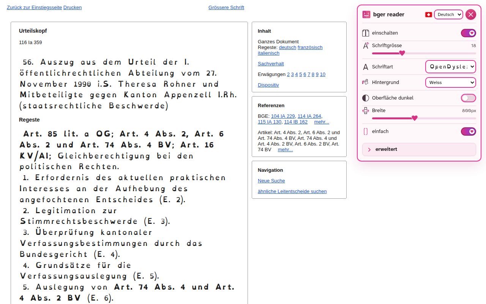

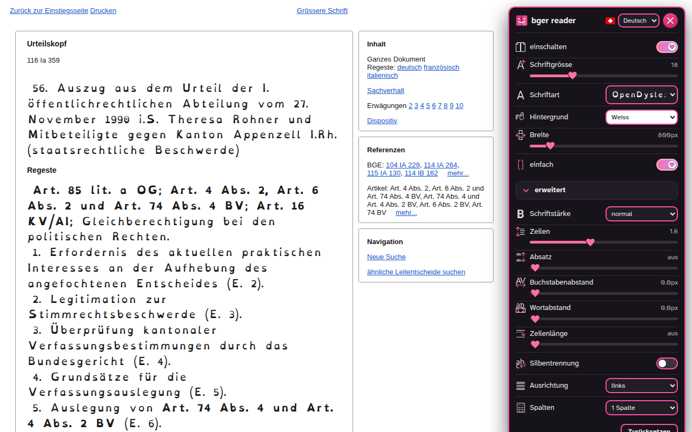

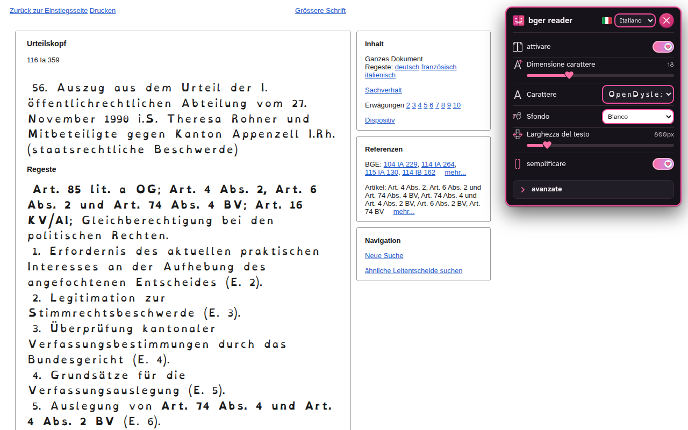

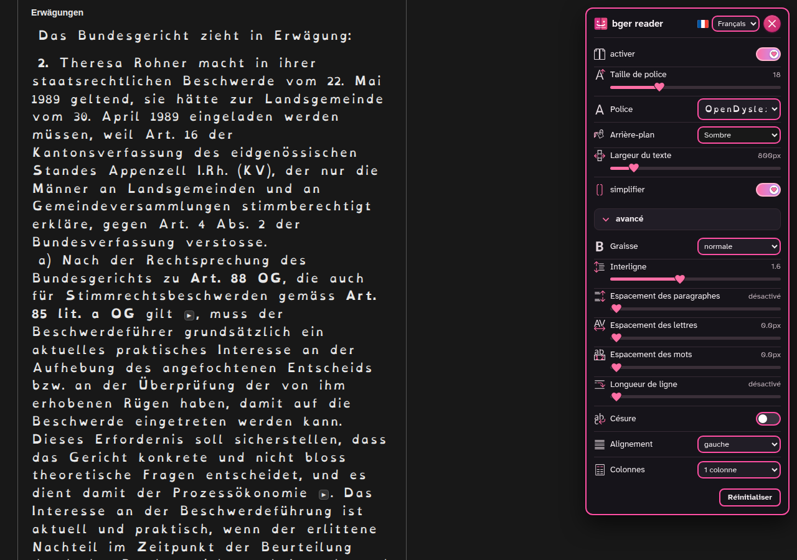

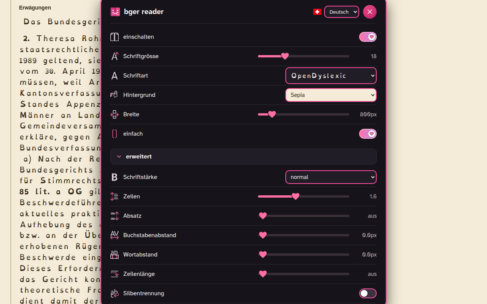

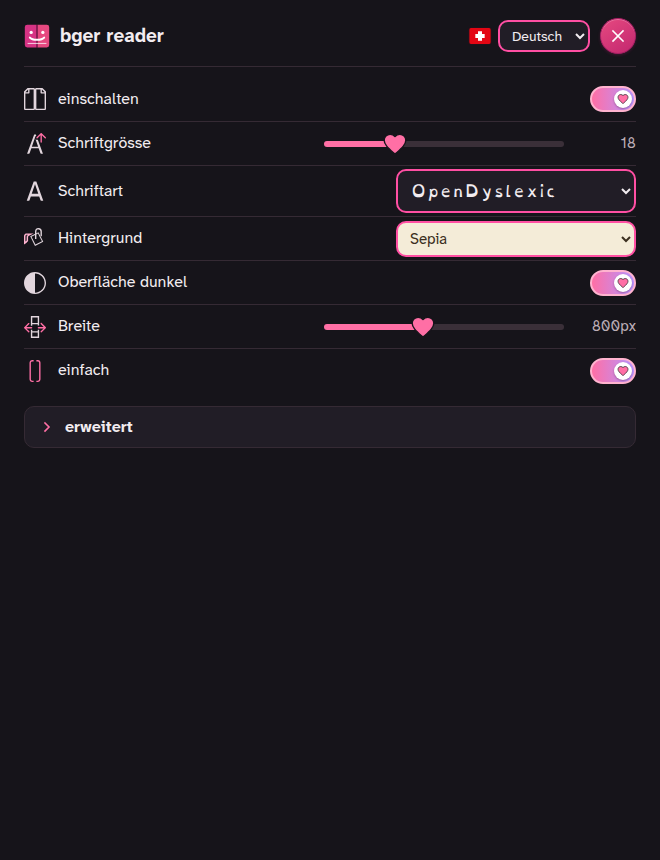

Alle Schriftarten, jeweils die Erwägungen desselben Entscheids:


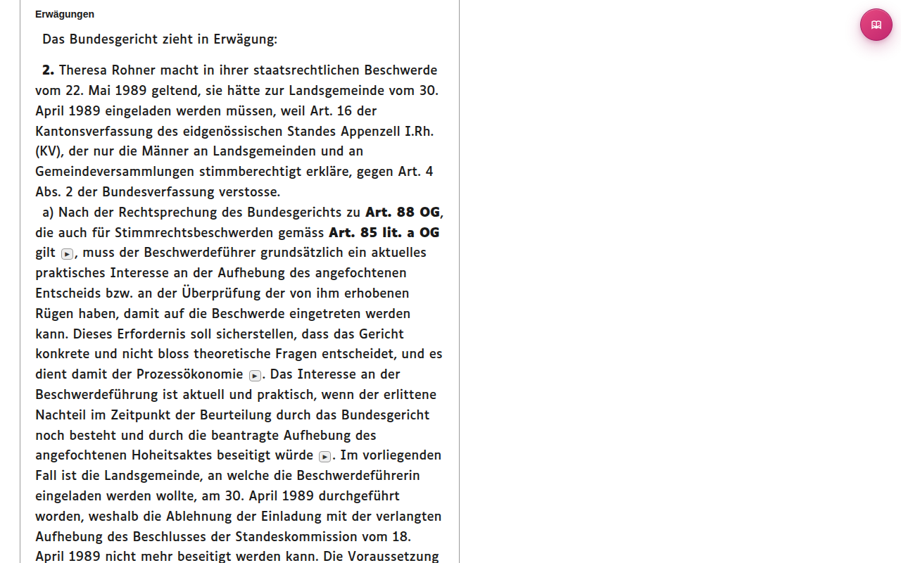

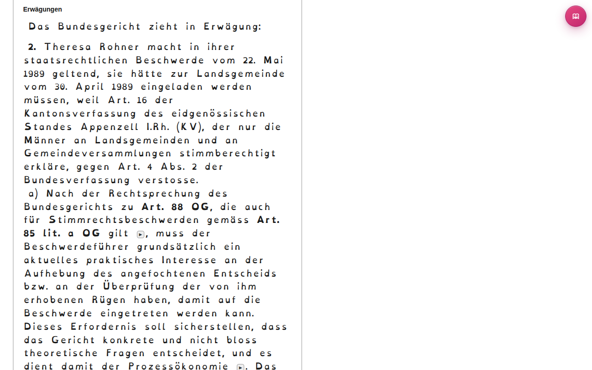

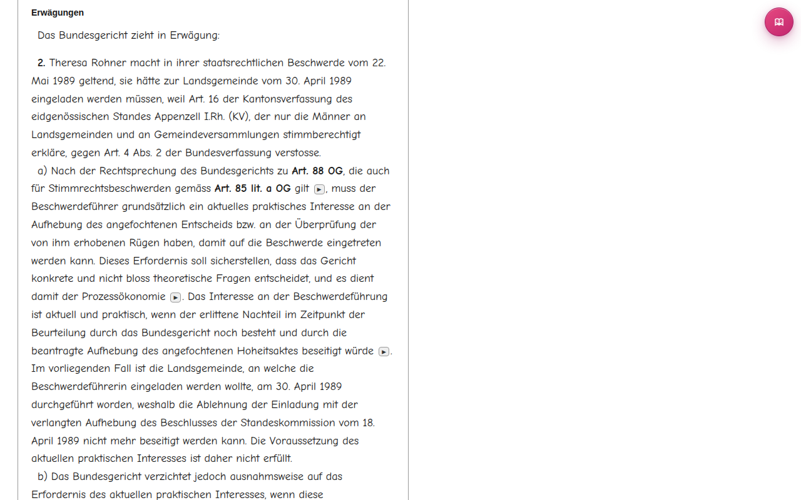

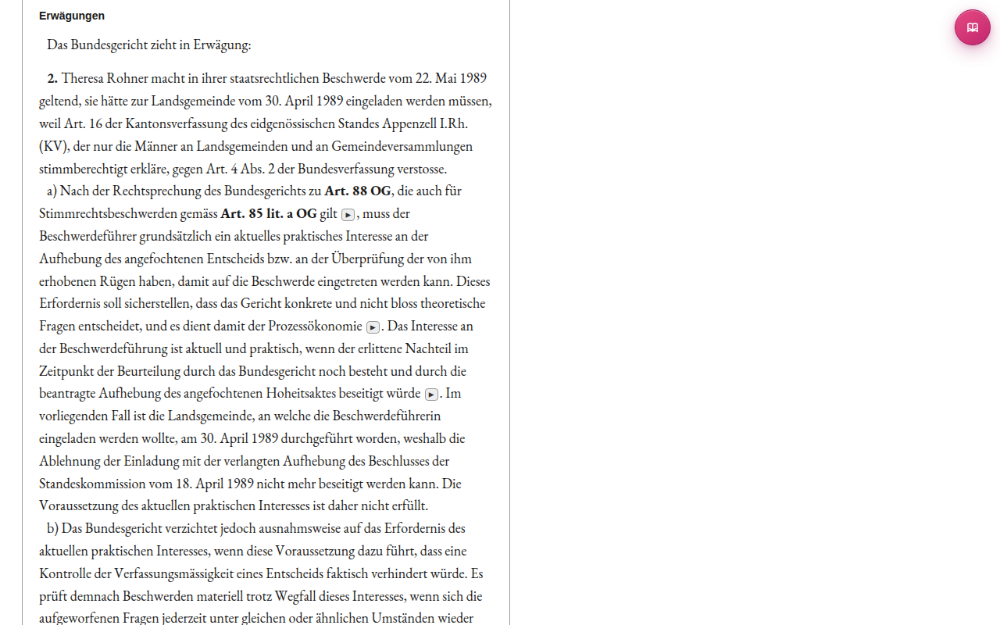

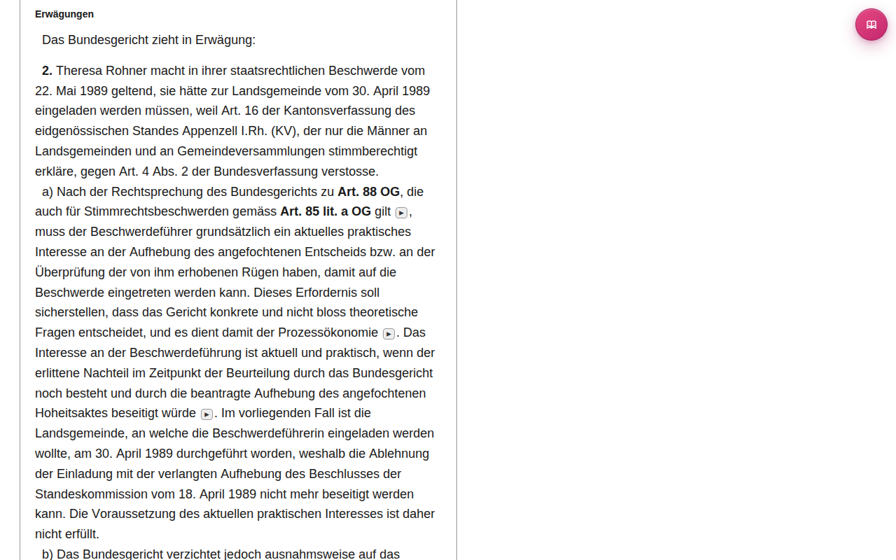

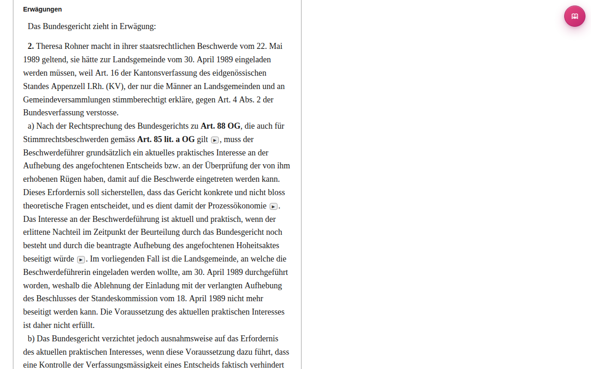

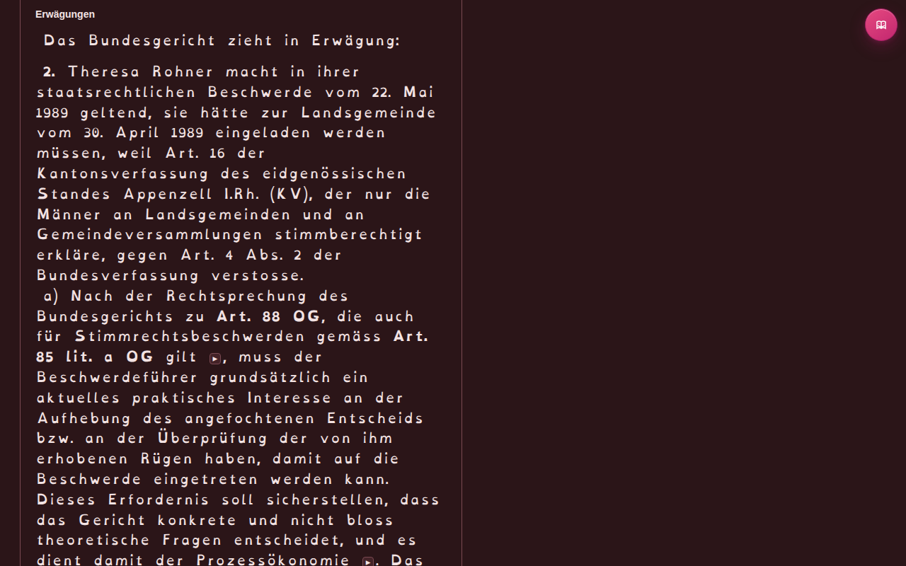

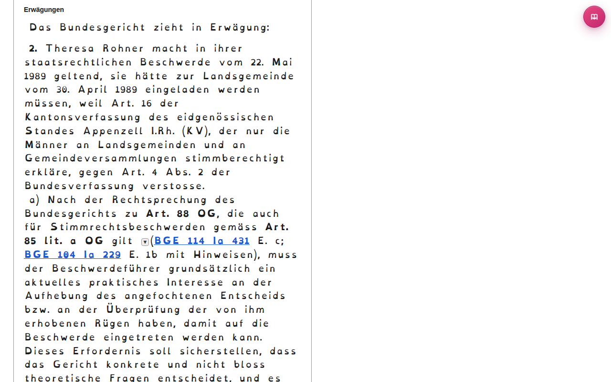


## Für Entwicklerinnen und Entwickler

Vanilla JavaScript, Manifest V3, keine Build-Pipeline, keine Abhängigkeiten im Paket. Das Herzstück ist `extension/content.js`; das Einstellungsfenster liegt in `extension/popup.html`, `popup.css` und `popup.js`, die Texte der Bedienoberfläche in vier Sprachen in `extension/sprachen.js`, das Hintergrundskript in `extension/background.js`. Die Test-Suite läuft ohne Framework mit jsdom, der Browser-Smoke-Test mit Playwright (Chromium und Edge) und Selenium (Firefox). Als Testseiten dienen echte, inhaltlich unverfängliche Entscheide (BGE 116 Ia 359 zum Frauenstimmrecht, BGE 145 I 207 zur Heiratsstrafe-Abstimmung, ein Revisionsentscheid zu Appenzeller Käse und ein Entscheid des Bundesverwaltungsgerichts zum Artenschutz); sie werden nicht im Repository abgelegt, sondern bei Bedarf geladen.

```
git clone https://github.com/cursorblinkrate-boop/bger-reader-addon.git
cd bger-reader-addon
bash tools/fetch-fixtures.sh
cd test && npm install --no-save jsdom@30.1.0 && node test-runner.js
```

Erwartet wird «0 fehlgeschlagen». Die Texte der Bedienoberfläche in allen vier Sprachen stehen zum Prüfen und Korrigieren in [SPRACHEN.md](SPRACHEN.md); `node tools/sprachen-tabelle.js uebernehmen` schreibt Korrekturen in den Code zurück. Name und Kurzbeschreibung der Erweiterung liegen in `extension/_locales/` (vier Sprachen), die Store-Texte, Bilder und der Ablauf für Einreichung und Updates in `store/`. Die Versionsnummer steht nur in `extension/manifest.json` und wird mit `node tools/version.js patch|minor|major` erhöht; `bash tools/release.sh` baut das Paket `dist/bger-reader-<Version>.zip`. Bei jedem Push auf `main` mit grünen Tests entsteht daraus automatisch ein GitHub-Release. Der [Änderungsverlauf](CHANGELOG.md) beschreibt, was sich von Version zu Version geändert hat; die Arbeitsregeln für Sessions mit Claude Code stehen in `STARTPROMPT.md`.

## Lizenz

Der Code steht unter der [MIT-Lizenz](LICENSE). Die mitgelieferten Schriften stehen unter der SIL Open Font License 1.1, Luciole unter Creative Commons BY 4.0 ([extension/fonts/LICENSES.md](extension/fonts/LICENSES.md)). Die Icons neben den Einstellungen stammen aus dem Icon-Thema Colibre von LibreOffice (CC0), das Symbol der Erweiterung ist ein eigenes Werk ([extension/icons/LICENSES.md](extension/icons/LICENSES.md)).

## Sicherheit

Sicherheitsprobleme bitte nicht öffentlich melden, sondern wie in [SECURITY.md](SECURITY.md) beschrieben. Unterstützt wird immer nur die neueste Version von der Releases-Seite.
