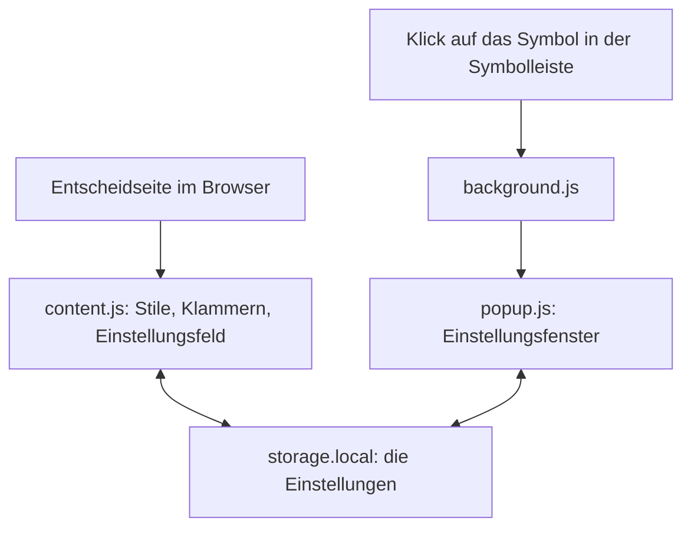
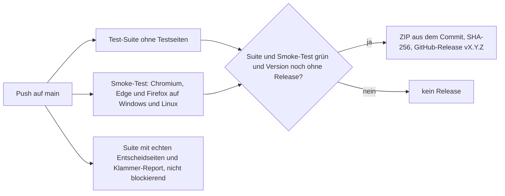

**Deutsch** · [English](EN-Development.md) · [Français](FR-Developpement.md) · [Italiano](IT-Sviluppo.md)

Diese Seite richtet sich an alle, die den Code von bger reader verstehen, prüfen oder daran mitarbeiten möchten. Sie beschreibt den Aufbau des Repositories, die Arbeitsweise der Erweiterung, die Tests, die Versionierung und den Weg vom Commit zum veröffentlichten Paket. Verbindliche Kurzfassung der Arbeitsregeln sind die Dateien `CLAUDE.md` und `STARTPROMPT.md` im Repository.

## Grundsätze

bger reader ist bewusst klein gehalten: rund 2000 Zeilen gewöhnliches JavaScript, verteilt auf wenige Dateien, ohne Framework, ohne Build-Werkzeug und ohne Abhängigkeiten im ausgelieferten Paket. Was im Repository steht, ist genau das, was der Browser ausführt. Die Erweiterung folgt dem aktuellen Erweiterungsstandard der Browser (Manifest V3) und läuft mit einem einzigen Code auf Chrome, Brave, Edge und Firefox. Sie arbeitet vollständig offline. Für die Entwicklung gibt es genau drei Test-Abhängigkeiten, die nie ins Paket gelangen: jsdom für die Test-Suite, Playwright und Selenium für den Browser-Smoke-Test. Weitere Abhängigkeiten sind unerwünscht.

## Aufbau des Repositories

| Pfad | Inhalt |
|---|---|
| `extension/manifest.json` | Manifest V3 der Erweiterung, einzige Stelle mit der Versionsnummer |
| `extension/content.js` | Das Herzstück: Klammer-Engine, Stile, Seitenprofile, Einstellungsfeld, Speicher, Live-Abgleich; alles in einer Datei |
| `extension/background.js` | Hintergrundskript: öffnet beim Klick auf das Symbol das Einstellungsfenster |
| `extension/popup.html`, `popup.css`, `popup.js` | Das Einstellungsfenster mit denselben Bedienelementen wie das Feld auf der Seite |
| `extension/fonts/` | Die mitgelieferten Schriften als WOFF2 samt Lizenzen |
| `extension/icons/` | Symbol der Erweiterung in drei Grössen, Lizenznachweis der Zeilen-Icons |
| `test/test-runner.js` | Test-Suite ohne Framework, acht nummerierte Blöcke |
| `test/render-check.js` | Erzeugt Bildschirmfotos der Testseiten in allen Farbschemata zum Sichten |
| `test/browser-smoke.js` | Smoke-Test der fertigen Erweiterung in echtem Chromium, Edge und Firefox |
| `test/browser-umgebung.js` | Gemeinsame Basis für Smoke-Test und Screenshots: lokaler Server, der die Testseiten unter ihren echten Hostnamen ausliefert, und ein Adapter für Chromium, Edge und Firefox |
| `test/fixtures/` | Echte Entscheidseiten für die Tests; nicht im Repository, werden per Skript geladen |
| `tools/fetch-fixtures.sh` | Lädt die Testseiten und das Site-CSS der Gerichtsseiten |
| `tools/klammern-report.js` | Listet jede Klammer der Testseiten mit Entscheidung und Begründung |
| `tools/version.js` | Zeigt oder erhöht die Version und legt den Eintrag im Änderungsverlauf an |
| `tools/release.sh` | Baut das Paket `dist/bger-reader-<Version>.zip` und prüft Tests, Grösse und Prüfsumme |
| `tools/screenshots.js` | Erzeugt die Bilder für Store und Dokumentation, rund 30 Szenen je Browser, mit Bildunterschriften in einer `GALERIE.md` |
| `tools/subset-fonts.py` | Erzeugt die WOFF2-Schriften reproduzierbar aus den Originaldateien |
| `.github/workflows/tests.yml` | Automatische Tests bei jedem Push und das Release aus `main` |
| `.github/workflows/wiki.yml` | Spiegelt den Ordner `wiki/` ins GitHub-Wiki |
| `wiki/` | Die Seiten dieses Wikis als Markdown-Dateien |
| `CHANGELOG.md` | Änderungsverlauf; der Abschnitt der aktuellen Version wird zur Release-Notiz |
| `CLAUDE.md`, `STARTPROMPT.md`, `SYSTEMPROMPT.md` | Arbeitsregeln und Startprompt für die Arbeit mit einem KI-Assistenten |
| `SECURITY.md`, `LICENSE` | Meldeweg für Sicherheitsprobleme, Lizenz |

## Wie die Erweiterung arbeitet

Die Erweiterung besteht aus drei Teilen, die über den lokalen Erweiterungsspeicher des Browsers zusammenhängen. Das Inhaltsskript `content.js` wird vom Browser auf jeder Entscheidseite gestartet und macht dort die eigentliche Arbeit. Das Hintergrundskript `background.js` reagiert nur auf den Klick auf das Symbol in der Symbolleiste und öffnet das Einstellungsfenster. Das Fenster selbst, `popup.html` mit `popup.js`, schreibt seine Einstellungen in denselben Speicher wie das Inhaltsskript. Weil der Browser jede Änderung im Speicher an alle Teile meldet, wirken Einstellungen aus dem Fenster sofort auf der Seite und umgekehrt, ohne dass die Teile direkt miteinander sprechen und ohne zusätzliche Berechtigungen.



Auf der Entscheidseite lädt `content.js` zuerst die gespeicherten Einstellungen. Erst danach werden die Stile angewendet, die Klammern verarbeitet, das Einstellungsfeld befüllt und die Bedienelemente angeschlossen; ein Klick vor dem Laden könnte sonst Standardwerte über die gespeicherten schreiben. Die Stile werden nicht Element für Element gesetzt, sondern als CSS-Variablen und wenige Klassen auf dem Wurzelelement der Seite; ein einmal eingefügtes Stylesheet mit `!important`-Regeln übersetzt sie in Schrift, Farben und Abstände der Entscheidabsätze. Regeln, die das Layout verändern könnten (Textbreite, Zeilenlänge, Ausrichtung, Absatzabstand, Spalten), werden nur aktiviert, wenn die Einstellung vom Standard abweicht; im Standard bleibt die Seite pixelgleich.

Das Einstellungsfeld lebt in einem Shadow DOM, einem abgeschotteten Bereich der Seite: Das CSS der Gerichtsseite kann das Feld nicht verunstalten, und das CSS des Feldes berührt die Seite nicht. Die Icons neben den Einstellungen sind als Inline-SVG eingebettet; sie stammen aus dem Icon-Thema Colibre von LibreOffice (CC0) und stehen als identische Zeichenketten sowohl in `content.js` als auch in `popup.html`, was ein Testblock absichert, weil es keinen Build-Schritt gibt, der sie zusammenführen könnte.

Bei der Bedienung werden drei Wege nach Aufwand unterschieden. Änderungen an Schrift und Farben setzen nur CSS-Variablen und wirken bei jeder Reglerbewegung sofort. Das Ein- und Ausschalten des Lesemodus oder der Klammern baut zusätzlich die Klammerhüllen neu auf, was deutlich teurer ist, aber nur dann nötig. Das Speichern wird während des Ziehens eines Reglers gebündelt (höchstens alle 0,4 Sekunden), Auswahl, Häkchen und das Loslassen eines Reglers speichern sofort. Der Speicher meldet jede Änderung auch an die Seite zurück, die sie selbst geschrieben hat; dieses Echo wird am geschriebenen Paket erkannt und ignoriert, sonst würde das Echo eines älteren Schreibvorgangs eine jüngere Einstellung zurückdrehen.

Die Klammer-Engine ist als eigenes Modul `BGerReader` am Anfang von `content.js` gebaut und für Tests über `window.BGerReader` erreichbar. Sie baut pro Absatz eine Karte aller Textknoten auf, findet Klammern mit einem Stapel (sicher gegen Verschachtelung), entscheidet mit den auf [Klammern einklappen](DE-Klammern.md) beschriebenen Regeln und hüllt die Treffer über einen DOM-Bereich (Range) ein, sodass Links und Formatierungen erhalten bleiben. Die Regeln selbst stehen als Konstanten `POLITIK` am Anfang des Regelkerns; `BGerReader.begruendung()` erklärt für jeden Klammertext, warum er eingeklappt wird oder offen bleibt.

Für `bvger.weblaw.ch` gibt es ein eigenes Seitenprofil. Weil die Website eine React-App ist, die den Entscheid nachlädt und bei Navigation ohne Neuladen austauscht, beobachtet `content.js` dort den Seitenbaum mit einem MutationObserver, gedrosselt auf einen Timer von 150 Millisekunden, und baut Stile und Klammern nur dann neu auf, wenn sich der Textblock tatsächlich geändert hat. Der Textblock wird als das Kind des Entscheid-Segments mit den meisten Absätzen erkannt und erhält zur Laufzeit die Klasse `bkl-text`; die Sprache wird am Rubrum erkannt und für die Silbentrennung gesetzt.

## Entwicklungsumgebung einrichten

Nötig sind Git, Node.js (Version 22 oder neuer) und `curl`. Ein frischer Klon ist in vier Befehlen einsatzbereit; die Testseiten werden von den Gerichtsseiten geladen und sind absichtlich nicht im Repository, weil sie gross sind und fremdes Material enthalten.

```
git clone https://github.com/cursorblinkrate-boop/bger-reader-addon.git
cd bger-reader-addon
bash tools/fetch-fixtures.sh
cd test && npm install --no-save jsdom@30.1.0 && node test-runner.js
```

Erwartet wird die letzte Zeile «0 fehlgeschlagen». Die Gesamtzahl der Prüfungen wächst mit jedem neuen Test und ist bewusst nirgends festgeschrieben; Massstab ist nur, dass nichts fehlschlägt. Ohne Testseiten wird Block [3] übersprungen. Für den Browser-Smoke-Test kommen Playwright und Selenium dazu; da im Ordner `test` bewusst keine `package.json` liegt, entfernt `npm install` nicht genannte Pakete, deshalb immer alle zusammen installieren:

```
cd test && npm install --no-save jsdom@30.1.0 playwright@1.56.1 selenium-webdriver@4.49.0
(cd test && npx playwright install chromium)
node test/browser-smoke.js chromium
node test/browser-smoke.js edge
node test/browser-smoke.js firefox
node tools/screenshots.js chromium
```

Edge verwendet das auf dem Rechner installierte Microsoft Edge und braucht keinen Download; Firefox und den passenden Treiber holt Selenium bei Bedarf selbst. Der letzte Befehl erzeugt die Bilder für Store und Dokumentation, wahlweise auch mit `edge` oder `firefox`.

Zum Ausprobieren im eigenen Browser wird der Ordner `extension/` direkt als entpackte Erweiterung geladen, wie unter [Installation](DE-Installation.md) beschrieben; nach jeder Änderung genügt ein Klick auf «Aktualisieren» auf der Erweiterungsseite und ein Neuladen der Entscheidseite.

## Tests

Die Test-Suite in `test/test-runner.js` kommt ohne Test-Framework aus: eine kleine Funktion `pruefe()` zählt bestandene und fehlgeschlagene Prüfungen, und jsdom stellt einen Browser-Seitenbaum ohne Browser bereit. Die Suite ist bewusst kompakt gehalten, ein Test pro Sachverhalt, und Fehlschläge nennen die betroffenen Fälle im Detailtext. Die Blöcke sind nummeriert:

| Block | Was geprüft wird |
|---|---|
| [1] Einklapp-Regeln | Ein Korpus von rund 120 Klammern in sechs Kategorien gegen die Regeln, ausgewertet je Kategorie |
| [2] Einklappen im DOM | Hüllen bauen und wieder entfernen, Roundtrip zeichengenau, Seitenwechsel-Balken, verschachtelte Klammern |
| [3] Echte Entscheidseiten | Die geladenen Testseiten: Absätze gefunden, Klammern verarbeitet, nichts verloren; wird ohne Testseiten übersprungen |
| [4] Panel und Stile | Beschriftungen laut Entwurf, CSS-Variablen, Layout-Neutralität, Farbschemata, Icons |
| [5] Speicher und Live-Sync | Laden, Speichern, Bündelung, Echo-Erkennung, Bedienung erst nach dem Laden |
| [6] Paket | Manifest, Version gegen den Änderungsverlauf, freigegebene Schriftdateien |
| [7] Pop-up-Fenster | Das Fenster hat dieselben Bedienelemente, Icons und Vorschau-Regeln wie das Feld auf der Seite |
| [8] bvger.weblaw.ch | Nachladen, Ersetzen, Navigation ohne Neuladen, Spracherkennung, Spalten und Textbreite |

`test/render-check.js` erzeugt zusätzlich Bildschirmfotos der Testseiten in allen fünf Farbschemata; das Skript ist für die Sichtprüfung nach Änderungen an Panel oder CSS gedacht und setzt einen lokal installierten Chrome voraus. `test/browser-smoke.js` prüft die fertige Erweiterung in einem echten Chromium (steht für Chrome und Brave), in Microsoft Edge und in Firefox: Einbindung über das Manifest auf der echten Adresse, Zusammenspiel mit dem CSS der Gerichtsseite, mitgelieferte Schriften, Speichern über ein Neuladen hinweg, Live-Abgleich zwischen Fenster und Seite, Druckansicht. Weil `search.bger.ch` hinter einem Bot-Schutz liegt, der automatisierten Browsern eine Captcha-Seite liefert, liefert ein lokaler Server aus `test/browser-umgebung.js` die Testseiten unter ihren echten Hostnamen aus, und derselbe Baustein stellt den einheitlichen Adapter für die drei Browser bereit; nur `bvger.weblaw.ch` wird live geladen und bei Nichterreichbarkeit mit Hinweis übersprungen. Die Bildschirmfotos landen in `test/smoke/<browser>/` und sollen angeschaut werden, nicht nur gezählt.

`tools/screenshots.js` nutzt dieselbe Umgebung, um die Bilder für die Browser-Stores und die Dokumentation zu erzeugen: rund 30 Szenen je Browser mit jeder Schrift, jedem Hintergrund und jeder Einstellung, dem Einstellungsfenster, Übersichten über ein bis zwei Bildschirmseiten und der Druckansicht, im Store-Format von 1280 mal 800 Bildpunkten. Dazu entsteht eine `GALERIE.md` mit einer Bildunterschrift je Bild als Vorlage für README und Store-Texte. In der automatischen Prüfung liegen die Bilder als Artefakt `screenshots-<os>-<browser>` bei jedem Lauf.

`tools/klammern-report.js` ist das Werkzeug für die Trefferquote der Klammerregeln: Es listet für die Testseiten jede Klammer mit der Entscheidung und der Begründung auf. Stimmt eine Zeile nicht, ist genau das der Fall, der als Testfall in Block [1] gehört. Der Report wird auch in der automatischen Prüfung erzeugt und liegt dort als herunterladbares Artefakt bei.

## Version und Änderungsverlauf

Die Versionsnummer steht an genau einer Stelle, in `extension/manifest.json`, und wird nie von Hand geändert. Jede nutzersichtbare Änderung erhöht die Version mit `node tools/version.js patch` (Korrektur), `minor` (neue Funktion) oder `major` (Umbau) nach [Semantic Versioning](https://semver.org/lang/de/). Das Werkzeug legt zugleich oben in `CHANGELOG.md` einen Eintrag mit einer TODO-Zeile an, die vor dem Push durch die Beschreibung der Änderung ersetzt wird; Testblock [6] prüft, dass Manifest und Verlauf übereinstimmen. Reine Test- oder Werkzeug-Änderungen erhöhen die Version nicht.

## Vom Commit zum Release

Bei jedem Push führt GitHub Actions die Tests aus. Der Pflichtlauf der Suite kommt ohne Testseiten aus, damit er nicht von der Erreichbarkeit der Gerichtsseiten abhängt. Ein zweiter Lauf mit den echten Entscheidseiten und dem Klammer-Report ist wertvoll, aber nicht blockierend, weil er bei einer Änderung am HTML der Gerichtsseite rot werden darf. Der Browser-Smoke-Test läuft auf Windows und Linux, jeweils in Chromium, Edge und Firefox, und hängt jedem Lauf seine Bildschirmfotos als Artefakte an; im Anschluss erzeugt `tools/screenshots.js` die Bilder für Store und Dokumentation als weiteres Artefakt, ohne dass ein fehlendes Bild das Release blockieren könnte.



Sind Suite und Smoke-Test bei einem Push auf `main` grün und hat die Version im Manifest noch kein Release, entsteht das Paket direkt aus dem Commit mit `git archive`. Das ist reproduzierbar: gleicher Commit, gleiche Bytes, gleiche Prüfsumme, auch lokal nachbaubar, und es geschieht ohne npm-Installation in dem einzigen Job, der Schreibrechte hat, sodass ein manipuliertes Paket aus einer Abhängigkeit gar nicht erst ins Release gelangen könnte. Neben dem ZIP wird die SHA-256-Prüfsumme als eigene Datei veröffentlicht, und der Abschnitt der Version aus `CHANGELOG.md` wird zur Release-Notiz. Die Releases-Seite ist der einzige Download-Ort für das Paket; lokal baut `bash tools/release.sh` dasselbe Paket zur Kontrolle, prüft vorher die Suite und danach die Grösse (höchstens 1023 KB, derzeit rund 250 KB).

## Arbeitsregeln

Das Projekt wird von einer Person gepflegt und grösstenteils mit einem KI-Assistenten (Claude Code) entwickelt; `CLAUDE.md` und `STARTPROMPT.md` sind die Anweisungen dafür und zugleich die knappste Beschreibung der Spielregeln. Die wichtigsten davon: Änderungen gehen direkt auf `main`, ohne Feature-Branches und ohne Pull Requests. Vor jedem Push muss die volle Suite ohne Fehlschlag laufen, bei Änderungen an Panel oder CSS zusätzlich die Sichtprüfung per Bildschirmfoto, und vor einem Store-Upload werden die Bilder aus dem CI-Lauf angesehen, nicht nur der grüne Haken. Neue Tests werden nur geschrieben, wenn sie eine konkrete Änderung absichern, und die Suite soll klein bleiben. Commit-Nachrichten sind auf Deutsch: eine Kurzzeile, eine Leerzeile, dann Aufzählungspunkte mit Begründung und einem Hinweis, wie die Änderung geprüft wurde. Neue Abhängigkeiten, Docker oder zusätzliche Umgebungen sind nicht erwünscht. SVG-Icons für das Feld haben einen Zeichenbereich von 16 mal 16, Strichstärke 1.5 bis 1.6 und färben sich über `currentColor`.

## Wiki und Dokumentation pflegen

Die Seiten dieses Wikis liegen als Markdown-Dateien im Ordner `wiki/` des Repositories und werden von dort bei jedem Push auf `main`, der den Ordner berührt, durch den Workflow `.github/workflows/wiki.yml` ins GitHub-Wiki kopiert. Änderungen an der Dokumentation werden deshalb wie Code-Änderungen gemacht: Datei in `wiki/` bearbeiten, committen, pushen. Änderungen direkt im Wiki über dessen Bearbeiten-Knopf werden beim nächsten Lauf überschrieben.

Das Wiki gibt es in vier Sprachen. Jede Seite existiert viermal, und der Dateiname beginnt mit dem Sprachkürzel: `DE-Installation.md`, `EN-Installation.md`, `FR-Installation.md`, `IT-Installazione.md`. `Home.md` ist die Sprachwahl, auf der jedes Wiki landet, und die erste Zeile jeder Seite ist die Sprachleiste mit den Links auf dieselbe Seite in den drei anderen Sprachen. Die deutsche Fassung ist die Quelle: Inhaltliche Änderungen werden zuerst dort gemacht und dann in die Übersetzungen übertragen, damit die vier Fassungen nicht auseinanderlaufen. Die Bedienoberfläche der Erweiterung selbst ist nur auf Deutsch; die Übersetzungen nennen deshalb jede Beschriftung im deutschen Wortlaut und erklären sie in der jeweiligen Sprache.

Links zwischen den Seiten werden in den Dateien mit Endung geschrieben, etwa `DE-Installation.md`, damit sie auch im Repository funktionieren; der Workflow entfernt die Endung beim Kopieren, weil das Wiki Seiten ohne Endung anspricht. Dateinamen bleiben ohne Umlaute, Akzente und Leerzeichen, weil sie zur Adresse der Seite werden. `_Sidebar.md` ist die Navigation, `_Footer.md` die Fusszeile, und `wiki/README.md` beschreibt den Ordner samt der Namenstabelle aller Seiten, ohne selbst eine Wiki-Seite zu sein. Das Wiki muss einmalig in den Einstellungen des Repositories eingeschaltet und mit einer ersten Seite angelegt werden; bis dahin endet der Workflow mit einem Hinweis statt mit einem Fehler.

## Vorgeschichte

Das Projekt begann als Tampermonkey-Userscript, das mit Version 2.1.0 eingefroren wurde und im Git-Tag `userscript-2.1.0` erhalten bleibt. Mit Version 0.2.0 wurde es zur Erweiterung nach Manifest V3; die Zählung begann dabei neu. Das alte Skript dient nicht als Vorlage, Änderungen geschehen nur noch in `extension/content.js`.
