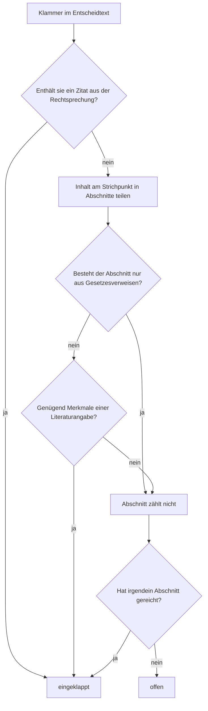

**Deutsch** · [English](EN-Brackets.md) · [Français](FR-Parentheses.md) · [Italiano](IT-Parentesi.md)

Entscheide der Schweizer Gerichte sind voller Klammern. Ein grosser Teil davon sind Fundstellen: Zitate aus der Rechtsprechung wie `(BGE 135 II 45 E. 3.2 S. 47)` und Literaturangaben wie `(NIGGLI/WIPRÄCHTIGER, Basler Kommentar, 4. Aufl. 2019, N. 12 zu Art. 47 StGB)`. Sie sind wichtig zum Nachschlagen, aber beim Lesen lesen sie sich wie eine Rechnung: Zahlenketten, deren Inhalt man nicht im Kopf hat und die den Gedankengang unterbrechen. bger reader klappt solche Fundstellen ein, wenn die Einstellung **einfach** angehakt ist. An ihrer Stelle bleibt ein kleiner Knopf `▸`; ein Klick öffnet die Klammer an Ort und Stelle, ein weiterer schliesst sie wieder. Nichts wird gelöscht, und beim Drucken erscheint immer der vollständige Text.

## Die Grundregel

Eingeklappt wird, was **Fundstelle** ist. Alles andere ist Entscheidtext und bleibt offen, auch wenn Zahlen darin vorkommen.

Als Fundstelle gelten zwei Arten von Klammerinhalten. Erstens **Rechtsprechung**: Zitate aus der amtlichen Sammlung (BGE, ATF, DTF, BVGE, ATAF, DTAF, TPF), Urteile mit Aktenzeichen (`6B_123/2020`, `A-1234/2019`, `SK.2019.12`), die Praxis des Bundesgerichts (`Pra 2005 Nr. 12`) sowie Entscheide des EGMR und des EuGH. Sobald ein solches Zitat irgendwo in der Klammer steht, wird die ganze Klammer eingeklappt, auch wenn sie kurz ist oder daneben noch anderes enthält. Zweitens **Literatur**: Kommentare, Aufsätze, Lehrbücher und Online-Quellen, erkannt an ihrer bibliografischen Form, also an Merkmalen wie Autorennamen in Kapitälchen, Auflage, «in:», Werktyp, Zeitschriftenkürzel, Randnote und Erscheinungsjahr.

Offen bleiben insbesondere **Gesetzesverweise** wie `(Art. 8 Abs. 1 BV)` oder `(Art. 47 StGB; Art. 49 Abs. 1 StGB)`. Das ist eine bewusste Entscheidung: Der Gehalt einer Gesetzesbestimmung muss beim Lesen ohnehin verstanden werden, und der Verweis ist kurz. Ebenfalls offen bleiben Beträge, Mengen, Daten, Verweise auf die eigenen Erwägungen des Entscheids wie `(E. 4.2 hiervor)`, inhaltliche Bemerkungen, lateinische Wendungen wie `(in dubio pro reo)` und das eigene Aktenzeichen des Verfahrens im Rubrum, etwa `(dossier 6B_399/2024)`, denn dieses verweist auf nichts, was nachgeschlagen werden müsste. Länge und Anzahl Ziffern spielen keine Rolle; eine Klammer wird nur eingeklappt, wenn sie positiv als Fundstelle erkannt ist.

Die Regeln gelten für deutsche, französische und italienische Entscheide gleichermassen; die Erkennung kennt die Zitierweisen aller drei Sprachen (`ATF`, `arrêt`, `consid.`, `DTF`, `sentenza`, `cpv.`, `lett.`).

## Beispiele

| Klammer | Ergebnis | Grund |
|---|---|---|
| `(BGE 135 II 45 E. 3.2 S. 47)` | eingeklappt | Rechtsprechung: Zitat aus der amtlichen Sammlung |
| `(ATF 143 IV 27 consid. 2.2)` | eingeklappt | Rechtsprechung, französische Zitierweise |
| `(Urteil 6B_123/2020 vom 3. März 2021 E. 2.1)` | eingeklappt | Rechtsprechung: Urteil mit Aktenzeichen |
| `(BVGE 2014/1 E. 5)` | eingeklappt | Rechtsprechung des Bundesverwaltungsgerichts |
| `(Pra 2005 Nr. 12)` | eingeklappt | Rechtsprechung: Praxis des Bundesgerichts |
| `(Art. 8 BV; BGE 135 II 45)` | eingeklappt | enthält ein Zitat aus der Rechtsprechung |
| `(NIGGLI/WIPRÄCHTIGER, Basler Kommentar, 4. Aufl. 2019, N. 12 zu Art. 47 StGB)` | eingeklappt | Literatur: Autorenpaar, Kommentar, Auflage, Randnote, Jahr |
| `(vgl. STRATENWERTH, Schweizerisches Strafrecht AT I, 4. Aufl. 2011, § 6 N. 12)` | eingeklappt | Literatur: Autorensignatur, Auflage, Randnote, Jahr |
| `(a.a.O., N. 15)` | eingeklappt | Literatur: Rückverweis auf ein bereits zitiertes Werk |
| `(Art. 8 Abs. 1 BV)` | offen | Gesetzesverweis |
| `(Art. 47 StGB; Art. 49 Abs. 1 StGB)` | offen | nur Gesetzesverweise |
| `(Art. 6 Ziff. 1 EMRK)` | offen | Gesetzesverweis, auch bei Staatsverträgen |
| `(E. 4.2 hiervor)` | offen | Verweis auf die eigenen Erwägungen |
| `(Fr. 3'000.--)` | offen | Betrag |
| `(12. Januar 2021)` | offen | Datum |
| `(in dubio pro reo)` | offen | lateinische Wendung, Entscheidtext |
| `(vgl. dazu die Ausführungen der Vorinstanz)` | offen | inhaltliche Bemerkung |
| `(dossier 6B_399/2024)` | offen | eigenes Aktenzeichen im Rubrum |

## Wie die Entscheidung im Einzelnen fällt

Die Erweiterung geht Absatz für Absatz durch den Entscheidtext, sucht die Klammern und prüft jede einzeln nach demselben Ablauf. Bei ineinander verschachtelten Klammern wird nur die äussere betrachtet; die innere bleibt Teil ihres Inhalts, es gibt also keine Klappe in der Klappe.

Zuerst wird der Klammerinhalt vereinheitlicht (geschützte Leerzeichen und typografische Apostrophe der Gerichtsseite werden normalisiert). Dann wird nach Rechtsprechung gesucht; ein Treffer genügt. Fehlt sie, wird der Inhalt am Strichpunkt geteilt, weil die Schweizer Zitierkonvention getrennte Fundstellen so aneinanderreiht, und jeder Abschnitt wird auf die Form einer Literaturangabe geprüft. Ein Abschnitt, der im Wesentlichen aus Gesetzesverweisen besteht, zählt dabei nicht; die Erkennung von Erlasskürzeln (BV, OR, StGB, SchKG, VStrR und jede künftige Abkürzung nach demselben Muster) ist so gebaut, dass sie keine Liste braucht.

Für die Literatur werden Punkte gesammelt. Jedes Merkmal ist einen bestimmten Wert wert, und ab einer Schwelle von 3 Punkten gilt der Abschnitt als Literatur. Sieht der Abschnitt aus wie ein Satz, weil er mehrere Funktionswörter wie «dass», «weil», «ist» oder «nicht» enthält, liegt die Schwelle bei 5 Punkten, damit inhaltliche Bemerkungen mit einer beiläufigen Jahreszahl nicht eingeklappt werden.

| Merkmal | Beispiel | Punkte |
|---|---|---|
| Rückverweis auf ein zitiertes Werk | `a.a.O.`, `op. cit.`, `ibid.` | 3 |
| Autorensignatur in Kapitälchen mit Komma | `STRATENWERTH,` | 2 |
| Autorenpaar | `Niggli/Wiprächtiger` | 2 |
| Auflage | `4. Aufl.`, `2e éd.` | 2 |
| Einleitung eines Sammelwerks oder einer Zeitschrift | `in:` | 2 |
| Werktyp oder Fachverlag | `Kommentar`, `Handbuch`, `Diss.`, `Schulthess` | 2 |
| Kommentar-Kürzel mit Bearbeiter | `BSK StPO-Schmid`, `CR CP-Dupont` | 2 |
| Zeitschriftenkürzel | `ZStrR`, `AJP`, `SJZ`, `JdT`, `Jusletter` | 2 |
| Online-Quelle mit Abrufdatum | `abgerufen am`, `consulté le` | 2 |
| Herausgeber | `Hrsg.`, `éd.` | 1 |
| Online-Hinweis oder Adresse | `online`, `www.` | 1 |
| Randnote oder Seite | `N. 12`, `Rz. 45`, `S. 123`, `p. 45` | 1 |
| Erscheinungsjahr | `2019` | 1 |

Gesetzesverweise und Tagesdaten werden vor dem Zählen entfernt, damit `Art. 6 EMRK,` nicht als Autorensignatur und `12. Januar 2021` nicht als Erscheinungsjahr zählt.

## Was beim Einklappen mit der Seite geschieht

Die eingeklappte Klammer wird samt allen Links und Formatierungen in eine kleine Hülle gelegt, die zunächst verborgen ist; davor steht der Klappknopf. Die Seitenwechsel-Balken der amtlichen Sammlung, etwa «BGE 152 IV 1 S. 7», die mitten in einem Absatz stehen können, werden aus der Hülle herausgenommen und bleiben sichtbar, damit die Seitenzahlen zum Zitieren nicht verschwinden. Wird der Lesemodus oder die Einstellung **einfach** ausgeschaltet, werden alle Hüllen wieder entfernt, und der Absatz ist Zeichen für Zeichen wieder das Original. Schrift, Farben und Abstände zu verstellen berührt die Klammern nicht; von Hand geöffnete Klammern bleiben dabei offen.

## Wenn eine Klammer falsch behandelt wird

Keine Regel trifft jeden Fall. Eine Klammer, die fälschlich eingeklappt wurde, lässt sich mit dem Pfeil sofort öffnen; wer die Klammern insgesamt nicht möchte, entfernt das Häkchen bei **einfach**. Damit die Regeln besser werden, hilft eine Meldung als [Issue](https://github.com/cursorblinkrate-boop/bger-reader-addon/issues) mit dem Klammertext im Wortlaut und, wenn möglich, der Adresse des Entscheids. Jeder gemeldete Fall kann als Testfall aufgenommen werden, sodass er auch in Zukunft richtig behandelt wird.

Für die Entwicklung gibt es ein Werkzeug, das für echte Entscheidseiten jede Klammer mit der getroffenen Entscheidung und der Begründung auflistet; es wird bei jedem Testlauf ausgeführt und ist unter [Entwicklung](DE-Entwicklung.md) beschrieben. Bei der ersten Prüfung an zwei echten Entscheiden wurden 56 von 58 Klammern richtig behandelt, und die beiden übrigen Fälle sind seither in den Regeln berücksichtigt.
