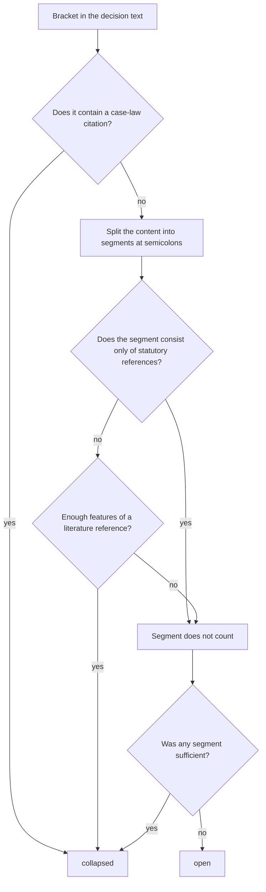

[Deutsch](DE-Klammern.md) · **English** · [Français](FR-Parentheses.md) · [Italiano](IT-Parentesi.md)

<!-- Do not edit here in the wiki: the source is the file wiki/EN-Brackets.md in the repository, and the workflow overwrites the wiki on every push. The German page wiki/DE-Klammern.md is the master: make content changes there first, then carry them into this translation. -->

Decisions of the Swiss courts are full of brackets (parentheses). A large part of them are citations: references to case law such as `(BGE 135 II 45 E. 3.2 S. 47)` and references to legal literature such as `(NIGGLI/WIPRÄCHTIGER, Basler Kommentar, 4. Aufl. 2019, N. 12 zu Art. 47 StGB)`. They are important for looking things up, but while reading they read like an invoice: strings of numbers whose content you do not have in your head and which interrupt the line of reasoning. bger reader collapses such citations when the setting **einfach** (simple) is ticked. In their place, a small button `▸` remains; one click opens the bracket in place, another closes it again. Nothing is deleted, and when printing, the complete text always appears.

## The basic rule

What is collapsed is whatever is a **citation**. Everything else is text of the decision and stays open, even if it contains numbers.

Two kinds of bracket content count as citations. First, **case law**: citations from the official collection (BGE, ATF, DTF, BVGE, ATAF, DTAF, TPF), judgments with docket numbers (`6B_123/2020`, `A-1234/2019`, `SK.2019.12`), the Praxis des Bundesgerichts law report (`Pra 2005 Nr. 12`) and decisions of the ECtHR and the CJEU. As soon as such a citation appears anywhere in the bracket, the whole bracket is collapsed, even if it is short or contains other things besides. Second, **legal literature**: commentaries, articles, textbooks and online sources, recognised by their bibliographic form, that is by features such as author names in small capitals, edition, «in:», type of work, journal abbreviation, margin number and year of publication.

What stays open, in particular, are **statutory references** such as `(Art. 8 Abs. 1 BV)` or `(Art. 47 StGB; Art. 49 Abs. 1 StGB)`. This is a deliberate decision: the content of a statutory provision has to be understood while reading anyway, and the reference is short. Also left open are amounts, quantities, dates, references to the decision's own considerations such as `(E. 4.2 hiervor)` (consideration 4.2 above), substantive remarks, Latin phrases such as `(in dubio pro reo)` and the case's own docket number in the heading of the decision (rubrum), for example `(dossier 6B_399/2024)`, since it refers to nothing that would need to be looked up. Length and number of digits play no role; a bracket is collapsed only if it is positively recognised as a citation.

The rules apply equally to German, French and Italian decisions; the recognition knows the citation styles of all three languages (`ATF`, `arrêt`, `consid.`, `DTF`, `sentenza`, `cpv.`, `lett.`).

## Examples

| Bracket | Result | Reason |
|---|---|---|
| `(BGE 135 II 45 E. 3.2 S. 47)` | collapsed | case law: citation from the official collection |
| `(ATF 143 IV 27 consid. 2.2)` | collapsed | case law, French citation style |
| `(Urteil 6B_123/2020 vom 3. März 2021 E. 2.1)` | collapsed | case law: judgment with docket number |
| `(BVGE 2014/1 E. 5)` | collapsed | case law of the Federal Administrative Court |
| `(Pra 2005 Nr. 12)` | collapsed | case law: Praxis des Bundesgerichts |
| `(Art. 8 BV; BGE 135 II 45)` | collapsed | contains a case-law citation |
| `(NIGGLI/WIPRÄCHTIGER, Basler Kommentar, 4. Aufl. 2019, N. 12 zu Art. 47 StGB)` | collapsed | legal literature: pair of authors, commentary, edition, margin number, year |
| `(vgl. STRATENWERTH, Schweizerisches Strafrecht AT I, 4. Aufl. 2011, § 6 N. 12)` | collapsed | legal literature: author name, edition, margin number, year |
| `(a.a.O., N. 15)` | collapsed | legal literature: back-reference to a work already cited |
| `(Art. 8 Abs. 1 BV)` | open | statutory reference |
| `(Art. 47 StGB; Art. 49 Abs. 1 StGB)` | open | statutory references only |
| `(Art. 6 Ziff. 1 EMRK)` | open | statutory reference, also for international treaties |
| `(E. 4.2 hiervor)` | open | reference to the decision's own considerations |
| `(Fr. 3'000.--)` | open | amount |
| `(12. Januar 2021)` | open | date |
| `(in dubio pro reo)` | open | Latin phrase, text of the decision |
| `(vgl. dazu die Ausführungen der Vorinstanz)` | open | substantive remark |
| `(dossier 6B_399/2024)` | open | the case's own docket number in the rubrum |

## How the decision is made in detail

The extension goes through the decision text paragraph by paragraph, looks for the brackets and checks each one individually following the same procedure. With brackets nested inside one another, only the outer one is considered; the inner one remains part of its content, so there is no toggle inside a toggle.

First, the bracket content is standardised (non-breaking spaces and typographic apostrophes from the court website are normalised). Then the content is searched for case law; one hit is enough. If there is none, the content is split at semicolons, because the Swiss citation convention strings separate citations together in this way, and each segment is checked for the form of a literature reference. A segment that consists essentially of statutory references does not count; the recognition of statute abbreviations (BV, OR, StGB, SchKG, VStrR and any future abbreviation following the same pattern) is built so that it needs no list.

For legal literature, points are collected. Each feature is worth a certain value, and from a threshold of 3 points the segment counts as literature. If the segment looks like a sentence because it contains several function words such as «dass», «weil», «ist» or «nicht» (that, because, is, not), the threshold is 5 points, so that substantive remarks with an incidental year are not collapsed.

| Feature | Example | Points |
|---|---|---|
| Back-reference to a cited work | `a.a.O.`, `op. cit.`, `ibid.` | 3 |
| Author name in small capitals followed by a comma | `STRATENWERTH,` | 2 |
| Pair of authors | `Niggli/Wiprächtiger` | 2 |
| Edition | `4. Aufl.`, `2e éd.` | 2 |
| Introduction of an edited volume or a journal | `in:` | 2 |
| Type of work or legal publisher | `Kommentar`, `Handbuch`, `Diss.`, `Schulthess` | 2 |
| Commentary abbreviation with contributing author | `BSK StPO-Schmid`, `CR CP-Dupont` | 2 |
| Journal abbreviation | `ZStrR`, `AJP`, `SJZ`, `JdT`, `Jusletter` | 2 |
| Online source with access date | `abgerufen am`, `consulté le` | 2 |
| Editor | `Hrsg.`, `éd.` | 1 |
| Online reference or web address | `online`, `www.` | 1 |
| Margin number or page | `N. 12`, `Rz. 45`, `S. 123`, `p. 45` | 1 |
| Year of publication | `2019` | 1 |

Statutory references and calendar dates are removed before counting, so that `Art. 6 EMRK,` does not count as an author name and `12. Januar 2021` does not count as a year of publication.

## What happens to the page when collapsing

The collapsed bracket, together with all its links and formatting, is placed in a small wrapper that is initially hidden; the toggle button sits in front of it. The page-break bars of the official collection, such as «BGE 152 IV 1 S. 7», which can appear in the middle of a paragraph, are taken out of the wrapper and remain visible, so that the page numbers for citing do not disappear. If the reading mode or the setting **einfach** is switched off, all wrappers are removed again, and the paragraph is once again the original, character for character. Adjusting font, colours and spacing does not touch the brackets; brackets opened by hand stay open in the process.

## When a bracket is handled wrongly

No rule fits every case. A bracket that was wrongly collapsed can be opened immediately with the arrow; if you do not want the brackets at all, remove the tick at **einfach**. To make the rules better, a report as an [Issue](https://github.com/cursorblinkrate-boop/bger-reader-addon/issues) with the exact text of the bracket and, if possible, the address of the decision helps. Every reported case can be added as a test case so that it is handled correctly in future as well.

For development, there is a tool that lists every bracket on real decision pages together with the decision taken and its reasoning; it runs with every test run and is described under [Development](EN-Development.md). In the first check on two real decisions, 56 of 58 brackets were handled correctly, and the two remaining cases have since been taken into account in the rules.
