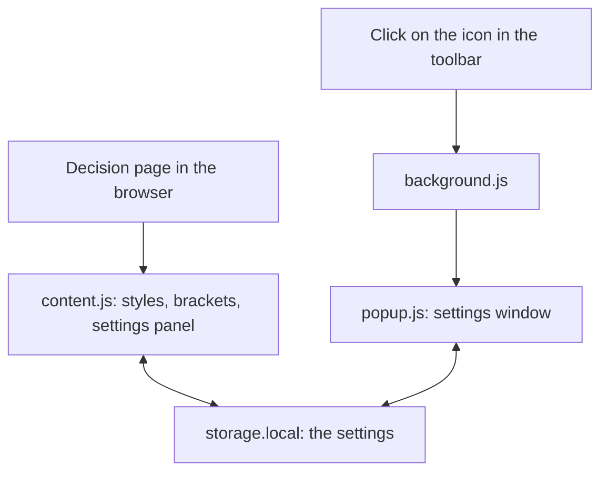
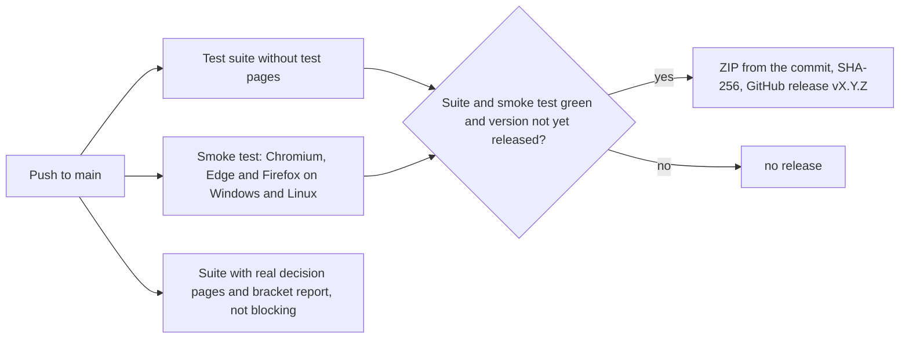

[Deutsch](DE-Entwicklung.md) · **English** · [Français](FR-Developpement.md) · [Italiano](IT-Sviluppo.md)

This page is aimed at everyone who wants to understand, check or contribute to the code of bger reader. It describes the structure of the repository, how the extension works, the tests, the versioning and the path from commit to published package. The binding short version of the working rules is in the files `CLAUDE.md` and `STARTPROMPT.md` in the repository.

## Principles

bger reader is deliberately kept small: around 2000 lines of ordinary JavaScript, spread over a few files, without a framework, without a build tool and without dependencies in the delivered package. What is in the repository is exactly what the browser executes. The extension follows the browsers' current extension standard (Manifest V3) and runs with a single code base on Chrome, Brave, Edge and Firefox. It works entirely offline. For development there are exactly three test dependencies, which never end up in the package: jsdom for the test suite, Playwright and Selenium for the browser smoke test. Further dependencies are unwelcome.

## Structure of the repository

| Path | Content |
|---|---|
| `extension/manifest.json` | Manifest V3 of the extension, the only place with the version number |
| `extension/content.js` | The core: bracket engine, styles, site profiles, settings panel, storage, live sync; all in one file |
| `extension/background.js` | Background script: opens the settings window when the icon is clicked |
| `extension/popup.html`, `popup.css`, `popup.js` | The settings window with the same controls as the panel on the page |
| `extension/fonts/` | The bundled fonts as WOFF2 together with licences |
| `extension/icons/` | Icon of the extension in three sizes, licence attribution for the row icons |
| `test/test-runner.js` | Test suite without a framework, eight numbered blocks |
| `test/render-check.js` | Creates screenshots of the test pages in all colour schemes for visual review |
| `test/browser-smoke.js` | Smoke test of the finished extension in real Chromium, Edge and Firefox |
| `test/browser-umgebung.js` | Shared basis for smoke test and screenshots: local server that serves the test pages under their real host names, and an adapter for Chromium, Edge and Firefox |
| `test/fixtures/` | Real decision pages for the tests; not in the repository, downloaded by script |
| `tools/fetch-fixtures.sh` | Downloads the test pages and the site CSS of the court websites |
| `tools/klammern-report.js` | Lists every bracket of the test pages with decision and reasoning |
| `tools/version.js` | Shows or increases the version and creates the entry in the changelog |
| `tools/release.sh` | Builds the package `dist/bger-reader-<Version>.zip` and checks tests, size and checksum |
| `tools/screenshots.js` | Creates the images for store and documentation, around 30 scenes per browser, with captions in a `GALERIE.md` |
| `tools/subset-fonts.py` | Generates the WOFF2 fonts reproducibly from the original files |
| `.github/workflows/tests.yml` | Automatic tests on every push and the release from `main` |
| `.github/workflows/wiki.yml` | Mirrors the folder `wiki/` into the GitHub wiki |
| `wiki/` | The pages of this wiki as Markdown files |
| `CHANGELOG.md` | Changelog; the section of the current version becomes the release note |
| `CLAUDE.md`, `STARTPROMPT.md`, `SYSTEMPROMPT.md` | Working rules and start prompt for working with an AI assistant |
| `SECURITY.md`, `LICENSE` | Reporting route for security problems, licence |

## How the extension works

The extension consists of three parts that are connected via the browser's local extension storage. The content script `content.js` is started by the browser on every decision page and does the actual work there. The background script `background.js` reacts only to the click on the icon in the toolbar and opens the settings window. The window itself, `popup.html` with `popup.js`, writes its settings to the same storage as the content script. Because the browser reports every change in the storage to all parts, settings from the window take effect immediately on the page and vice versa, without the parts talking to each other directly and without additional permissions.



On the decision page, `content.js` first loads the saved settings. Only then are the styles applied, the brackets processed, the settings panel filled and the controls connected; otherwise a click before loading could write default values over the saved ones. The styles are not set element by element but as CSS variables and a few classes on the root element of the page; a stylesheet inserted once, with `!important` rules, translates them into font, colours and spacing of the decision paragraphs. Rules that could change the layout (text width, line length, alignment, paragraph spacing, columns) are activated only if the setting differs from the default; at the default, the page remains pixel-identical.

The settings panel lives in a Shadow DOM, a sealed-off area of the page: the court website's CSS cannot disfigure the panel, and the panel's CSS does not touch the page. The icons next to the settings are embedded as inline SVG; they come from LibreOffice's Colibre icon theme (CC0) and exist as identical strings both in `content.js` and in `popup.html`, which a test block safeguards, because there is no build step that could merge them.

During operation, three paths are distinguished by cost. Changes to font and colours only set CSS variables and take effect immediately with every movement of a slider. Switching the reading mode or the brackets on and off additionally rebuilds the bracket wrappers, which is considerably more expensive but only necessary then. Saving is batched while a slider is being dragged (at most every 0.4 seconds); selections, checkboxes and releasing a slider save immediately. The storage also reports every change back to the page that wrote it itself; this echo is recognised by the written package and ignored, otherwise the echo of an older write could turn back a more recent setting.

The bracket engine is built as a separate module `BGerReader` at the start of `content.js` and is reachable for tests via `window.BGerReader`. Per paragraph, it builds a map of all text nodes, finds brackets with a stack (safe against nesting), decides with the rules described on [Collapsing brackets](EN-Brackets.md) and wraps the hits via a DOM range (Range), so that links and formatting are preserved. The rules themselves are constants `POLITIK` at the start of the rule core; `BGerReader.begruendung()` explains for every bracket text why it is collapsed or stays open.

For `bvger.weblaw.ch` there is a separate site profile. Because the website is a React app that fetches the decision afterwards and exchanges it on navigation without reloading, `content.js` there observes the page tree with a MutationObserver, throttled to a timer of 150 milliseconds, and rebuilds styles and brackets only if the text block has actually changed. The text block is recognised as the child of the decision segment with the most paragraphs and receives the class `bkl-text` at runtime; the language is recognised from the heading of the decision (rubrum) and set for hyphenation.

## Setting up the development environment

Required are Git, Node.js (version 22 or newer) and `curl`. A fresh clone is ready to use in four commands; the test pages (fixtures) are downloaded from the court websites and are deliberately not in the repository, because they are large and contain third-party material.

```
git clone https://github.com/cursorblinkrate-boop/bger-reader-addon.git
cd bger-reader-addon
bash tools/fetch-fixtures.sh
cd test && npm install --no-save jsdom@30.1.0 && node test-runner.js
```

The expected last line is «0 fehlgeschlagen» (0 failed). The total number of checks grows with every new test and is deliberately not fixed anywhere; the only yardstick is that nothing fails. Without test pages, block [3] is skipped. For the browser smoke test, Playwright and Selenium are added; since there is deliberately no `package.json` in the `test` folder, `npm install` removes packages that are not named, so always install all of them together:

```
cd test && npm install --no-save jsdom@30.1.0 playwright@1.56.1 selenium-webdriver@4.49.0
(cd test && npx playwright install chromium)
node test/browser-smoke.js chromium
node test/browser-smoke.js edge
node test/browser-smoke.js firefox
node tools/screenshots.js chromium
```

Edge uses the Microsoft Edge installed on the computer and needs no download; Selenium fetches Firefox and the matching driver itself when needed. The last command creates the images for store and documentation, optionally also with `edge` or `firefox`.

To try it out in your own browser, the folder `extension/` is loaded directly as an unpacked extension, as described under [Installation](EN-Installation.md); after every change, a click on «Update» on the extensions page and a reload of the decision page is enough.

## Tests

The test suite in `test/test-runner.js` gets by without a test framework: a small function `pruefe()` counts passed and failed checks, and jsdom provides a browser page tree without a browser. The suite is deliberately kept compact, one test per matter, and failures name the affected cases in the detail text. The blocks are numbered:

| Block | What is checked |
|---|---|
| [1] Collapsing rules | A corpus of around 120 brackets in six categories against the rules, evaluated per category |
| [2] Collapsing in the DOM | Building wrappers and removing them again, character-exact round trip, page-break bars, nested brackets |
| [3] Real decision pages | The downloaded test pages: paragraphs found, brackets processed, nothing lost; skipped without test pages |
| [4] Panel and styles | Labels as designed, CSS variables, layout neutrality, colour schemes, icons |
| [5] Storage and live sync | Loading, saving, batching, echo detection, operation only after loading |
| [6] Package | Manifest, version against the changelog, approved font files |
| [7] Pop-up window | The window has the same controls, icons and preview rules as the panel on the page |
| [8] bvger.weblaw.ch | Deferred loading, replacement, navigation without reload, language detection, columns and text width |

`test/render-check.js` additionally creates screenshots of the test pages in all five colour schemes; the script is intended for the visual check after changes to the panel or CSS and requires a locally installed Chrome. `test/browser-smoke.js` checks the finished extension in a real Chromium (standing in for Chrome and Brave), in Microsoft Edge and in Firefox: integration via the manifest on the real address, interplay with the court website's CSS, bundled fonts, saving across a reload, live sync between window and page, print view. Because `search.bger.ch` sits behind a bot protection that serves automated browsers a captcha page, a local server from `test/browser-umgebung.js` serves the test pages under their real host names, and the same building block provides the uniform adapter for the three browsers; only `bvger.weblaw.ch` is loaded live and skipped with a notice if it cannot be reached. The screenshots end up in `test/smoke/<browser>/` and are meant to be looked at, not just counted.

`tools/screenshots.js` uses the same environment to create the images for the browser stores and the documentation: around 30 scenes per browser with every font, every background and every setting, the settings window, overviews spanning one to two screen pages and the print view, in the store format of 1280 by 800 pixels. In addition, a `GALERIE.md` is created with a caption per image as a template for the README and store texts. In the automated checks, the images are attached to every run as the artifact `screenshots-<os>-<browser>`.

`tools/klammern-report.js` is the tool for the hit rate of the bracket rules: for the test pages, it lists every bracket with the decision and the reasoning. If a line is wrong, that is exactly the case that belongs in block [1] as a test case. The report is also generated in the automated checks and is attached there as a downloadable artifact.

## Version and changelog

The version number is in exactly one place, in `extension/manifest.json`, and is never changed by hand. Every user-visible change increases the version with `node tools/version.js patch` (fix), `minor` (new feature) or `major` (overhaul) according to [Semantic Versioning](https://semver.org/). At the same time, the tool creates an entry at the top of `CHANGELOG.md` with a TODO line that is replaced by the description of the change before the push; test block [6] checks that manifest and changelog match. Changes only to tests or tools do not increase the version.

## From commit to release

On every push, GitHub Actions runs the tests. The mandatory run of the suite works without test pages, so that it does not depend on the availability of the court websites. A second run with the real decision pages and the bracket report is valuable but not blocking, because it is allowed to go red when the HTML of a court website changes. The browser smoke test runs on Windows and Linux, in each case in Chromium, Edge and Firefox, and attaches its screenshots to every run as artifacts; afterwards, `tools/screenshots.js` creates the images for store and documentation as a further artifact, without a missing image being able to block the release.



If suite and smoke test are green on a push to `main` and the version in the manifest has no release yet, the package is created directly from the commit with `git archive`. This is reproducible: same commit, same bytes, same checksum, and it can be rebuilt locally as well; and it happens without an npm installation in the only job that has write access, so that a manipulated package from a dependency could not get into the release in the first place. Next to the ZIP, the SHA-256 checksum is published as a separate file, and the section for the version from `CHANGELOG.md` becomes the release note. The Releases page is the only download location for the package; locally, `bash tools/release.sh` builds the same package for verification, checks the suite beforehand and the size afterwards (at most 1023 KB, currently around 250 KB).

## Working rules

The project is maintained by one person and developed largely with an AI assistant (Claude Code); `CLAUDE.md` and `STARTPROMPT.md` are the instructions for it and at the same time the tersest description of the rules of the game. The most important of these: changes go directly to `main`, without feature branches and without pull requests. Before every push, the full suite must run without failure, with changes to the panel or CSS additionally the visual check by screenshot, and before a store upload the images from the CI run are looked at, not just the green tick. New tests are written only if they safeguard a concrete change, and the suite is meant to stay small. Commit messages are in German: a short line, a blank line, then bullet points with the reasoning and a note on how the change was checked. New dependencies, Docker or additional environments are not wanted. SVG icons for the panel have a drawing area of 16 by 16, a stroke width of 1.5 to 1.6 and take their colour via `currentColor`.

## Maintaining the wiki and documentation

The pages of this wiki are kept as Markdown files in the `wiki/` folder of the repository and are copied from there into the GitHub wiki by the workflow `.github/workflows/wiki.yml` on every push to `main` that touches the folder. Changes to the documentation are therefore made like code changes: edit the file in `wiki/`, commit, push. Changes made directly in the wiki via its edit button are overwritten on the next run.

The wiki exists in four languages. Every page exists four times, and the file name begins with the language code: `DE-Installation.md`, `EN-Installation.md`, `FR-Installation.md`, `IT-Installazione.md`. `Home.md` is the language chooser on which every wiki lands, and the first line of every page is the language bar with the links to the same page in the three other languages. The German version is the source: substantive changes are made there first and then carried over into the translations, so that the four versions do not drift apart. The user interface of the extension itself is only in German; the translations therefore give every label in its German wording and explain it in the respective language.

In the files, links between the pages are written with the file ending, for instance `DE-Installation.md`, so that they also work in the repository; the workflow removes the ending when copying, because the wiki addresses pages without it. File names remain without umlauts, accents and spaces, because they become the address of the page. `_Sidebar.md` is the navigation, `_Footer.md` the footer, and `wiki/README.md` describes the folder together with the table of names of all pages, without being a wiki page itself. The wiki must be switched on once in the repository settings and created with a first page; until then the workflow ends with a notice instead of an error.

## History

The project began as a Tampermonkey userscript, which was frozen at version 2.1.0 and is preserved in the Git tag `userscript-2.1.0`. With version 0.2.0 it became an extension under Manifest V3; the version numbering started afresh at that point. The old script does not serve as a template; changes are now made only in `extension/content.js`.
