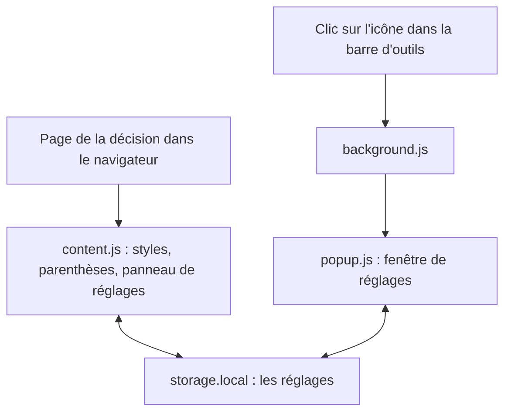
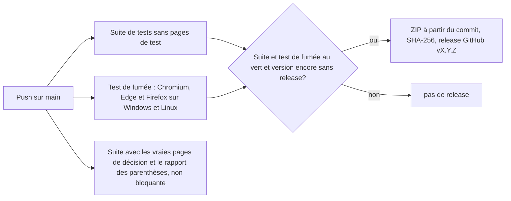

[Deutsch](DE-Entwicklung.md) · [English](EN-Development.md) · **Français** · [Italiano](IT-Sviluppo.md)

Cette page s'adresse à toutes les personnes qui souhaitent comprendre ou vérifier le code de bger reader, ou y contribuer. Elle décrit la structure du dépôt, le fonctionnement de l'extension, les tests, la gestion des versions et le chemin du commit au paquet publié. La version courte et contraignante des règles de travail se trouve dans les fichiers `CLAUDE.md` et `STARTPROMPT.md` du dépôt.

## Principes

bger reader est volontairement petit : environ 2000 lignes de JavaScript ordinaire, réparties sur quelques fichiers, sans framework, sans outil de build et sans dépendances dans le paquet livré. Ce qui se trouve dans le dépôt est exactement ce que le navigateur exécute. L'extension suit le standard actuel des extensions de navigateur (Manifest V3) et fonctionne avec un seul et même code sur Chrome, Brave, Edge et Firefox. Elle travaille entièrement hors ligne. Pour le développement, il existe exactement trois dépendances de test, qui n'entrent jamais dans le paquet : jsdom pour la suite de tests, Playwright et Selenium pour le test de fumée (smoke test) dans le navigateur. D'autres dépendances ne sont pas souhaitées.

## Structure du dépôt

| Chemin | Contenu |
|---|---|
| `extension/manifest.json` | Manifest V3 de l'extension, seul emplacement du numéro de version |
| `extension/content.js` | Le cœur : moteur des parenthèses, styles, profils de site, panneau de réglages, stockage, synchronisation en direct; tout dans un seul fichier |
| `extension/background.js` | Script d'arrière-plan : ouvre la fenêtre de réglages au clic sur l'icône |
| `extension/popup.html`, `popup.css`, `popup.js` | La fenêtre de réglages avec les mêmes éléments de commande que le panneau sur la page |
| `extension/fonts/` | Les polices fournies au format WOFF2, avec les licences |
| `extension/icons/` | Icône de l'extension en trois tailles, mention de licence des icônes de ligne |
| `test/test-runner.js` | Suite de tests sans framework, huit blocs numérotés |
| `test/render-check.js` | Produit des captures d'écran des pages de test dans tous les jeux de couleurs, pour contrôle visuel |
| `test/browser-smoke.js` | Test de fumée de l'extension finie dans de vrais Chromium, Edge et Firefox |
| `test/browser-umgebung.js` | Base commune du test de fumée et des captures d'écran : serveur local qui sert les pages de test sous leurs vrais noms d'hôte, et adaptateur pour Chromium, Edge et Firefox |
| `test/fixtures/` | Vraies pages de décision pour les tests; pas dans le dépôt, chargées par script |
| `tools/fetch-fixtures.sh` | Charge les pages de test et le CSS des sites des tribunaux |
| `tools/klammern-report.js` | Liste chaque parenthèse des pages de test avec la décision prise et sa motivation |
| `tools/version.js` | Affiche ou augmente la version et crée l'entrée dans le journal des modifications |
| `tools/release.sh` | Construit le paquet `dist/bger-reader-<Version>.zip` et vérifie les tests, la taille et la somme de contrôle |
| `tools/screenshots.js` | Produit les images pour la boutique et la documentation, environ 30 scènes par navigateur, avec des légendes dans un fichier `GALERIE.md` |
| `tools/subset-fonts.py` | Produit les polices WOFF2 de manière reproductible à partir des fichiers d'origine |
| `.github/workflows/tests.yml` | Tests automatiques à chaque push et release depuis `main` |
| `.github/workflows/wiki.yml` | Copie le dossier `wiki/` dans le wiki GitHub |
| `wiki/` | Les pages de ce wiki sous forme de fichiers Markdown |
| `CHANGELOG.md` | Journal des modifications; la section de la version actuelle devient la note de release |
| `CLAUDE.md`, `STARTPROMPT.md`, `SYSTEMPROMPT.md` | Règles de travail et prompt de démarrage pour le travail avec un assistant IA |
| `SECURITY.md`, `LICENSE` | Voie de signalement des problèmes de sécurité, licence |

## Comment fonctionne l'extension

L'extension se compose de trois parties, reliées entre elles par le stockage local du navigateur réservé aux extensions. Le script de contenu `content.js` est démarré par le navigateur sur chaque page de décision et y fait le travail proprement dit. Le script d'arrière-plan `background.js` ne réagit qu'au clic sur l'icône dans la barre d'outils et ouvre la fenêtre de réglages. La fenêtre elle-même, `popup.html` avec `popup.js`, écrit ses réglages dans le même stockage que le script de contenu. Comme le navigateur signale chaque modification du stockage à toutes les parties, les réglages faits dans la fenêtre agissent immédiatement sur la page et inversement, sans que les parties se parlent directement et sans autorisations supplémentaires.



Sur la page de la décision, `content.js` charge d'abord les réglages enregistrés. Ce n'est qu'ensuite que les styles sont appliqués, les parenthèses traitées, le panneau de réglages rempli et les éléments de commande connectés; un clic avant le chargement pourrait sinon écraser les réglages enregistrés par des valeurs par défaut. Les styles ne sont pas posés élément par élément, mais sous forme de variables CSS et de quelques classes sur l'élément racine de la page; une feuille de style insérée une seule fois, avec des règles `!important`, les traduit en police, couleurs et espacements des paragraphes de la décision. Les règles qui pourraient modifier la mise en page (largeur du texte, longueur des lignes, alignement, espacement des paragraphes, colonnes) ne sont activées que si le réglage s'écarte de la valeur par défaut; par défaut, la page reste identique au pixel près.

Le panneau de réglages vit dans un Shadow DOM, une zone cloisonnée de la page : le CSS du site du tribunal ne peut pas défigurer le panneau, et le CSS du panneau ne touche pas la page. Les icônes à côté des réglages sont intégrées en SVG inline; elles proviennent du thème d'icônes Colibre de LibreOffice (CC0) et figurent comme chaînes de caractères identiques aussi bien dans `content.js` que dans `popup.html`, ce qu'un bloc de test garantit, parce qu'il n'y a pas d'étape de build qui pourrait les réunir.

Lors de l'utilisation, trois voies sont distinguées selon leur coût. Les modifications de police et de couleurs ne font que poser des variables CSS et agissent immédiatement à chaque mouvement du curseur. L'activation et la désactivation du mode lecture ou des parenthèses reconstruisent en plus les enveloppes des parenthèses, ce qui est nettement plus coûteux, mais n'est nécessaire que dans ce cas. L'enregistrement est regroupé pendant le glissement d'un curseur (au plus toutes les 0,4 secondes); la sélection dans une liste, les cases à cocher et le relâchement d'un curseur enregistrent immédiatement. Le stockage signale chaque modification aussi à la page qui l'a elle-même écrite; cet écho est reconnu au paquet écrit et ignoré, sinon l'écho d'une écriture plus ancienne annulerait un réglage plus récent.

Le moteur des parenthèses est construit comme module distinct `BGerReader` au début de `content.js` et accessible pour les tests via `window.BGerReader`. Il construit pour chaque paragraphe une carte de tous les nœuds de texte, trouve les parenthèses avec une pile (sûre face aux imbrications), décide selon les règles décrites sous [Replier les parenthèses](FR-Parentheses.md) et enveloppe les résultats par une plage DOM (Range), de sorte que les liens et la mise en forme sont conservés. Les règles elles-mêmes figurent comme constantes `POLITIK` au début du noyau des règles; `BGerReader.begruendung()` explique pour chaque texte de parenthèse pourquoi il est replié ou reste ouvert.

Pour `bvger.weblaw.ch`, il existe un profil de site distinct. Comme le site est une application React qui charge la décision après coup et la remplace lors de la navigation sans rechargement, `content.js` y observe l'arbre de la page avec un MutationObserver, limité par une minuterie de 150 millisecondes, et ne reconstruit les styles et les parenthèses que lorsque le bloc de texte a effectivement changé. Le bloc de texte est reconnu comme l'enfant du segment de la décision qui contient le plus de paragraphes et reçoit à l'exécution la classe `bkl-text`; la langue est reconnue au rubrum (en-tête de la décision) et définie pour la césure.

## Mettre en place l'environnement de développement

Il faut Git, Node.js (version 22 ou plus récente) et `curl`. Un clone frais est prêt à l'emploi en quatre commandes; les pages de test sont chargées depuis les sites des tribunaux et sont volontairement absentes du dépôt, parce qu'elles sont volumineuses et contiennent du matériel de tiers.

```
git clone https://github.com/cursorblinkrate-boop/bger-reader-addon.git
cd bger-reader-addon
bash tools/fetch-fixtures.sh
cd test && npm install --no-save jsdom@30.1.0 && node test-runner.js
```

La dernière ligne attendue est « 0 fehlgeschlagen » (0 échec). Le nombre total de vérifications croît avec chaque nouveau test et n'est volontairement fixé nulle part; le seul critère est que rien n'échoue. Sans pages de test, le bloc [3] est sauté. Pour le test de fumée dans le navigateur s'ajoutent Playwright et Selenium; comme le dossier `test` ne contient volontairement pas de `package.json`, `npm install` retire les paquets non mentionnés, il faut donc toujours tout installer ensemble :

```
cd test && npm install --no-save jsdom@30.1.0 playwright@1.56.1 selenium-webdriver@4.49.0
(cd test && npx playwright install chromium)
node test/browser-smoke.js chromium
node test/browser-smoke.js edge
node test/browser-smoke.js firefox
node tools/screenshots.js chromium
```

Edge utilise le Microsoft Edge installé sur l'ordinateur et n'a besoin d'aucun téléchargement; Selenium récupère lui-même Firefox et le pilote correspondant au besoin. La dernière commande produit les images pour la boutique et la documentation, au choix aussi avec `edge` ou `firefox`.

Pour essayer dans votre propre navigateur, le dossier `extension/` est chargé directement comme extension non empaquetée, comme décrit sous [Installation](FR-Installation.md); après chaque modification, un clic sur « Mettre à jour » sur la page des extensions et un rechargement de la page de la décision suffisent.

## Tests

La suite de tests dans `test/test-runner.js` se passe de framework de test : une petite fonction `pruefe()` compte les vérifications réussies et échouées, et jsdom fournit un arbre de page de navigateur sans navigateur. La suite est volontairement compacte, un test par situation, et les échecs nomment les cas concernés dans le texte de détail. Les blocs sont numérotés :

| Bloc | Ce qui est vérifié |
|---|---|
| [1] Règles de repli | Un corpus d'environ 120 parenthèses en six catégories confronté aux règles, évalué par catégorie |
| [2] Repli dans le DOM | Construire et retirer les enveloppes, aller-retour exact au caractère près, barres de changement de page, parenthèses imbriquées |
| [3] Vraies pages de décision | Les pages de test chargées : paragraphes trouvés, parenthèses traitées, rien de perdu; sauté sans pages de test |
| [4] Panneau et styles | Libellés conformes à la maquette, variables CSS, neutralité de la mise en page, jeux de couleurs, icônes |
| [5] Stockage et synchronisation en direct | Chargement, enregistrement, regroupement, détection de l'écho, utilisation seulement après le chargement |
| [6] Paquet | Manifest, version comparée au journal des modifications, fichiers de polices autorisés |
| [7] Fenêtre pop-up | La fenêtre a les mêmes éléments de commande, icônes et règles d'aperçu que le panneau sur la page |
| [8] bvger.weblaw.ch | Chargement différé, remplacement, navigation sans rechargement, détection de la langue, colonnes et largeur du texte |

`test/render-check.js` produit en outre des captures d'écran des pages de test dans les cinq jeux de couleurs; le script est destiné au contrôle visuel après des modifications du panneau ou du CSS et suppose un Chrome installé localement. `test/browser-smoke.js` vérifie l'extension finie dans un vrai Chromium (qui représente Chrome et Brave), dans Microsoft Edge et dans Firefox : intégration par le manifest sur la vraie adresse, interaction avec le CSS du site du tribunal, polices fournies, enregistrement conservé au-delà d'un rechargement, synchronisation en direct entre la fenêtre et la page, aperçu avant impression. Comme `search.bger.ch` se trouve derrière une protection anti-robots qui sert une page captcha aux navigateurs automatisés, un serveur local issu de `test/browser-umgebung.js` sert les pages de test sous leurs vrais noms d'hôte, et le même composant fournit l'adaptateur unifié pour les trois navigateurs; seul `bvger.weblaw.ch` est chargé en direct et sauté avec un avertissement s'il est inaccessible. Les captures d'écran sont déposées dans `test/smoke/<browser>/` et doivent être regardées, pas seulement comptées.

`tools/screenshots.js` utilise le même environnement pour produire les images destinées aux boutiques d'extensions et à la documentation : environ 30 scènes par navigateur avec chaque police, chaque arrière-plan et chaque réglage, la fenêtre de réglages, des vues d'ensemble sur une à deux pages d'écran et l'aperçu avant impression, au format de boutique de 1280 sur 800 pixels. S'y ajoute un fichier `GALERIE.md` avec une légende par image, comme modèle pour le README et les textes de boutique. Dans la vérification automatique, les images sont jointes à chaque exécution comme artefact `screenshots-<os>-<browser>`.

`tools/klammern-report.js` est l'outil pour le taux de réussite des règles de repli : il liste, pour les pages de test, chaque parenthèse avec la décision prise et sa motivation. Si une ligne est fausse, c'est précisément le cas qui doit entrer comme cas de test dans le bloc [1]. Le rapport est aussi produit dans la vérification automatique et y est joint comme artefact téléchargeable.

## Version et journal des modifications

Le numéro de version se trouve à un seul endroit, dans `extension/manifest.json`, et n'est jamais modifié à la main. Chaque modification visible pour les utilisateurs augmente la version avec `node tools/version.js patch` (correction), `minor` (nouvelle fonction) ou `major` (refonte) selon le [Semantic Versioning](https://semver.org/lang/fr/). L'outil crée en même temps en tête de `CHANGELOG.md` une entrée avec une ligne TODO, qui est remplacée avant le push par la description de la modification; le bloc de test [6] vérifie que le manifest et le journal concordent. Les modifications qui ne touchent que les tests ou les outils n'augmentent pas la version.

## Du commit à la release

À chaque push, GitHub Actions exécute les tests. L'exécution obligatoire de la suite se passe des pages de test, afin de ne pas dépendre de l'accessibilité des sites des tribunaux. Une seconde exécution avec les vraies pages de décision et le rapport des parenthèses est précieuse, mais non bloquante, parce qu'elle a le droit de passer au rouge en cas de modification du HTML du site du tribunal. Le test de fumée dans le navigateur s'exécute sur Windows et Linux, chaque fois dans Chromium, Edge et Firefox, et joint ses captures d'écran à chaque exécution comme artefacts; ensuite, `tools/screenshots.js` produit les images pour la boutique et la documentation comme artefact supplémentaire, sans qu'une image manquante puisse bloquer la release.



Si la suite et le test de fumée sont au vert lors d'un push sur `main` et que la version du manifest n'a pas encore de release, le paquet est produit directement à partir du commit avec `git archive`. C'est reproductible : même commit, mêmes octets, même somme de contrôle, reconstructible aussi localement, et cela se fait sans installation npm dans le seul job qui dispose de droits d'écriture, de sorte qu'un paquet manipulé provenant d'une dépendance ne pourrait même pas entrer dans la release. À côté du ZIP, la somme de contrôle SHA-256 est publiée comme fichier distinct, et la section de la version dans `CHANGELOG.md` devient la note de release. La page des releases est le seul lieu de téléchargement du paquet; localement, `bash tools/release.sh` construit le même paquet à titre de contrôle, vérifie au préalable la suite et ensuite la taille (au plus 1023 Ko, actuellement environ 250 Ko).

## Règles de travail

Le projet est entretenu par une seule personne et développé en grande partie avec un assistant IA (Claude Code); `CLAUDE.md` et `STARTPROMPT.md` en sont les instructions et en même temps la description la plus concise des règles du jeu. Les plus importantes : les modifications vont directement sur `main`, sans branches de fonctionnalités et sans pull requests. Avant chaque push, la suite complète doit s'exécuter sans échec, et, en cas de modifications du panneau ou du CSS, s'y ajoute le contrôle visuel par capture d'écran; avant un envoi vers la boutique, les images de l'exécution CI sont regardées, pas seulement la coche verte. De nouveaux tests ne sont écrits que s'ils sécurisent une modification concrète, et la suite doit rester petite. Les messages de commit sont en allemand : une ligne courte, une ligne vide, puis des puces avec la motivation et une indication de la manière dont la modification a été vérifiée. Les nouvelles dépendances, Docker ou des environnements supplémentaires ne sont pas souhaités. Les icônes SVG du panneau ont une zone de dessin de 16 sur 16, une épaisseur de trait de 1.5 à 1.6 et se colorent via `currentColor`.

## Entretenir le wiki et la documentation

Les pages de ce wiki se trouvent sous forme de fichiers Markdown dans le dossier `wiki/` du dépôt et sont copiées de là dans le wiki GitHub par le workflow `.github/workflows/wiki.yml` à chaque push sur `main` qui touche le dossier. Les modifications de la documentation se font donc comme des modifications de code : éditer le fichier dans `wiki/`, committer, pousser. Les modifications faites directement dans le wiki par son bouton de modification sont écrasées à l'exécution suivante.

Le wiki existe en quatre langues. Chaque page existe quatre fois, et le nom de fichier commence par le code de langue : `DE-Installation.md`, `EN-Installation.md`, `FR-Installation.md`, `IT-Installazione.md`. `Home.md` est le choix de langue sur lequel tout wiki atterrit, et la première ligne de chaque page est la barre de langues avec les liens vers la même page dans les trois autres langues. La version allemande est la source : les modifications de contenu y sont faites d'abord, puis reportées dans les traductions, afin que les quatre versions ne divergent pas. L'interface de l'extension elle-même n'existe qu'en allemand; les traductions nomment donc chaque libellé dans sa formulation allemande et l'expliquent dans la langue concernée.

Les liens entre les pages sont écrits dans les fichiers avec l'extension du fichier, par exemple `FR-Installation.md`, pour qu'ils fonctionnent aussi dans le dépôt; le workflow retire l'extension lors de la copie, parce que le wiki désigne les pages sans extension. Les noms de fichiers restent sans trémas, accents ni espaces, parce qu'ils deviennent l'adresse de la page. `_Sidebar.md` est la navigation, `_Footer.md` le pied de page, et `wiki/README.md` décrit le dossier avec le tableau des noms de toutes les pages, sans être lui-même une page du wiki. Le wiki doit être activé une fois dans les réglages du dépôt et créé avec une première page; d'ici là, le workflow se termine par un avertissement et non par une erreur.

## Historique

Le projet a commencé comme userscript Tampermonkey, gelé à la version 2.1.0 et conservé dans le tag Git `userscript-2.1.0`. Avec la version 0.2.0, il est devenu une extension selon le Manifest V3; le décompte a alors recommencé à zéro. L'ancien script ne sert pas de modèle; les modifications ne se font plus que dans `extension/content.js`.
