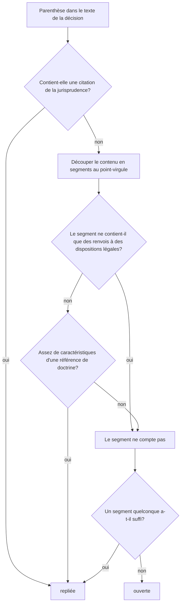

[Deutsch](DE-Klammern.md) · [English](EN-Brackets.md) · **Français** · [Italiano](IT-Parentesi.md)

Les décisions des tribunaux suisses sont pleines de parenthèses. Une grande partie d'entre elles sont des références : des citations de la jurisprudence comme `(BGE 135 II 45 E. 3.2 S. 47)` (« E. » y désigne le considérant et « S. » la page, soit ATF 135 II 45 consid. 3.2 p. 47) et des références de doctrine comme `(NIGGLI/WIPRÄCHTIGER, Basler Kommentar, 4. Aufl. 2019, N. 12 zu Art. 47 StGB)`. Elles sont importantes pour consulter les sources, mais à la lecture, elles se lisent comme un calcul : des suites de chiffres dont on n'a pas le contenu en tête et qui interrompent le fil du raisonnement. bger reader replie ces références lorsque le réglage **einfach** (simple) est coché. À leur place reste un petit bouton `▸`; un clic ouvre la parenthèse sur place, un autre la referme. Rien n'est supprimé, et à l'impression, le texte complet apparaît toujours.

## La règle de base

Est replié ce qui est une **référence**. Tout le reste est du texte de la décision et reste ouvert, même s'il contient des chiffres.

Deux types de contenus entre parenthèses sont considérés comme des références. Premièrement, la **jurisprudence** : les citations du recueil officiel (BGE, ATF, DTF, BVGE, ATAF, DTAF, TPF), les arrêts avec numéro de dossier (`6B_123/2020`, `A-1234/2019`, `SK.2019.12`), la Praxis du Tribunal fédéral (`Pra 2005 Nr. 12`) ainsi que les décisions de la CourEDH et de la CJUE. Dès qu'une telle citation figure quelque part dans la parenthèse, toute la parenthèse est repliée, même si elle est courte ou contient encore autre chose. Deuxièmement, la **doctrine** : commentaires, articles, manuels et sources en ligne, reconnus à leur forme bibliographique, c'est-à-dire à des caractéristiques telles que des noms d'auteurs en petites capitales, l'édition, « in: », le type d'ouvrage, l'abréviation d'une revue, le numéro marginal et l'année de parution.

Restent ouverts en particulier les **renvois à des dispositions légales** comme `(Art. 8 Abs. 1 BV)` ou `(Art. 47 StGB; Art. 49 Abs. 1 StGB)`. C'est un choix délibéré : le contenu d'une disposition légale doit de toute façon être compris à la lecture, et le renvoi est court. Restent également ouverts les montants, les quantités, les dates, les renvois aux propres considérants de la décision comme `(E. 4.2 hiervor)` (consid. 4.2 ci-dessus), les remarques de fond, les expressions latines comme `(in dubio pro reo)` et le numéro de dossier de la procédure elle-même dans le rubrum (en-tête de la décision), par exemple `(dossier 6B_399/2024)`, car celui-ci ne renvoie à rien qui doive être consulté. La longueur et le nombre de chiffres ne jouent aucun rôle; une parenthèse n'est repliée que si elle est positivement reconnue comme référence.

Les règles s'appliquent de la même manière aux décisions en allemand, en français et en italien; la reconnaissance connaît les modes de citation des trois langues (`ATF`, `arrêt`, `consid.`, `DTF`, `sentenza`, `cpv.`, `lett.`).

## Exemples

| Parenthèse | Résultat | Motif |
|---|---|---|
| `(BGE 135 II 45 E. 3.2 S. 47)` | repliée | jurisprudence : citation du recueil officiel |
| `(ATF 143 IV 27 consid. 2.2)` | repliée | jurisprudence, mode de citation français |
| `(Urteil 6B_123/2020 vom 3. März 2021 E. 2.1)` | repliée | jurisprudence : arrêt avec numéro de dossier |
| `(BVGE 2014/1 E. 5)` | repliée | jurisprudence du Tribunal administratif fédéral |
| `(Pra 2005 Nr. 12)` | repliée | jurisprudence : Praxis du Tribunal fédéral |
| `(Art. 8 BV; BGE 135 II 45)` | repliée | contient une citation de la jurisprudence |
| `(NIGGLI/WIPRÄCHTIGER, Basler Kommentar, 4. Aufl. 2019, N. 12 zu Art. 47 StGB)` | repliée | doctrine : duo d'auteurs, commentaire, édition, numéro marginal, année |
| `(vgl. STRATENWERTH, Schweizerisches Strafrecht AT I, 4. Aufl. 2011, § 6 N. 12)` | repliée | doctrine : signature d'auteur, édition, numéro marginal, année |
| `(a.a.O., N. 15)` | repliée | doctrine : renvoi à un ouvrage déjà cité |
| `(Art. 8 Abs. 1 BV)` | ouverte | renvoi à une disposition légale |
| `(Art. 47 StGB; Art. 49 Abs. 1 StGB)` | ouverte | uniquement des renvois à des dispositions légales |
| `(Art. 6 Ziff. 1 EMRK)` | ouverte | renvoi à une disposition légale, y compris dans les traités internationaux |
| `(E. 4.2 hiervor)` | ouverte | renvoi aux propres considérants |
| `(Fr. 3'000.--)` | ouverte | montant |
| `(12. Januar 2021)` | ouverte | date |
| `(in dubio pro reo)` | ouverte | expression latine, texte de la décision |
| `(vgl. dazu die Ausführungen der Vorinstanz)` | ouverte | remarque de fond |
| `(dossier 6B_399/2024)` | ouverte | propre numéro de dossier dans le rubrum |

## Comment la décision est prise dans le détail

L'extension parcourt le texte de la décision paragraphe par paragraphe, cherche les parenthèses et examine chacune d'elles individuellement selon le même déroulement. En cas de parenthèses imbriquées, seule la parenthèse extérieure est considérée; la parenthèse intérieure reste une partie de son contenu, il n'y a donc pas de repli dans le repli.

Le contenu de la parenthèse est d'abord uniformisé (les espaces insécables et les apostrophes typographiques du site du tribunal sont normalisés). Ensuite, la jurisprudence est recherchée; une seule occurrence suffit. À défaut, le contenu est découpé au point-virgule, parce que la convention de citation suisse enchaîne ainsi des références distinctes, et chaque segment est examiné quant à la forme d'une référence de doctrine. Un segment qui se compose pour l'essentiel de renvois à des dispositions légales ne compte pas; la reconnaissance des abréviations d'actes législatifs (BV, OR, StGB, SchKG, VStrR et toute abréviation future construite sur le même modèle) est conçue de manière à ne pas avoir besoin d'une liste.

Pour la doctrine, des points sont additionnés. Chaque caractéristique vaut un certain nombre de points, et à partir d'un seuil de 3 points, le segment est considéré comme de la doctrine. Si le segment ressemble à une phrase, parce qu'il contient plusieurs mots-outils comme « dass », « weil », « ist » ou « nicht », le seuil est de 5 points, afin que les remarques de fond contenant une année mentionnée en passant ne soient pas repliées.

| Caractéristique | Exemple | Points |
|---|---|---|
| Renvoi à un ouvrage déjà cité | `a.a.O.`, `op. cit.`, `ibid.` | 3 |
| Signature d'auteur en petites capitales suivie d'une virgule | `STRATENWERTH,` | 2 |
| Duo d'auteurs | `Niggli/Wiprächtiger` | 2 |
| Édition | `4. Aufl.`, `2e éd.` | 2 |
| Introduction d'un ouvrage collectif ou d'une revue | `in:` | 2 |
| Type d'ouvrage ou maison d'édition juridique | `Kommentar`, `Handbuch`, `Diss.`, `Schulthess` | 2 |
| Abréviation de commentaire avec nom de l'auteur de la contribution | `BSK StPO-Schmid`, `CR CP-Dupont` | 2 |
| Abréviation de revue | `ZStrR`, `AJP`, `SJZ`, `JdT`, `Jusletter` | 2 |
| Source en ligne avec date de consultation | `abgerufen am`, `consulté le` | 2 |
| Directeur de publication (éditeur) | `Hrsg.`, `éd.` | 1 |
| Mention en ligne ou adresse | `online`, `www.` | 1 |
| Numéro marginal ou page | `N. 12`, `Rz. 45`, `S. 123`, `p. 45` | 1 |
| Année de parution | `2019` | 1 |

Les renvois à des dispositions légales et les dates complètes sont retirés avant le comptage, afin que `Art. 6 EMRK,` ne compte pas comme signature d'auteur et `12. Januar 2021` pas comme année de parution.

## Ce qui arrive à la page lors du repli

La parenthèse repliée est placée, avec tous ses liens et sa mise en forme, dans une petite enveloppe d'abord masquée; devant elle se trouve le bouton de dépliage. Les barres de changement de page du recueil officiel, par exemple « BGE 152 IV 1 S. 7 », qui peuvent se trouver au milieu d'un paragraphe, sont sorties de l'enveloppe et restent visibles, afin que les numéros de page nécessaires à la citation ne disparaissent pas. Si le mode lecture ou le réglage **einfach** est désactivé, toutes les enveloppes sont retirées, et le paragraphe redevient, caractère pour caractère, l'original. Modifier la police, les couleurs et les espacements ne touche pas aux parenthèses; les parenthèses ouvertes à la main restent alors ouvertes.

## Quand une parenthèse est mal traitée

Aucune règle ne couvre tous les cas. Une parenthèse repliée à tort s'ouvre immédiatement avec la flèche; qui ne veut pas du tout des parenthèses repliées retire la coche de **einfach**. Pour que les règles s'améliorent, un signalement sous forme d'[Issue](https://github.com/cursorblinkrate-boop/bger-reader-addon/issues) avec le texte exact de la parenthèse et, si possible, l'adresse de la décision est utile. Chaque cas signalé peut être intégré comme cas de test, de sorte qu'il sera aussi traité correctement à l'avenir.

Pour le développement, il existe un outil qui, pour de vraies pages de décision, liste chaque parenthèse avec la décision prise et sa motivation; il est exécuté à chaque passage des tests et est décrit sous [Développement](FR-Developpement.md). Lors du premier examen sur deux décisions réelles, 56 parenthèses sur 58 ont été traitées correctement, et les deux cas restants ont depuis été pris en compte dans les règles.
