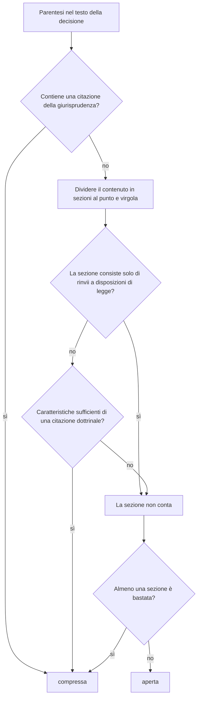

[Deutsch](DE-Klammern.md) · [English](EN-Brackets.md) · [Français](FR-Parentheses.md) · **Italiano**

<!-- Non modificare qui nel wiki: la fonte è il file wiki/IT-Parentesi.md nel repository e il workflow sovrascrive il wiki a ogni push. La pagina tedesca wiki/DE-Klammern.md è quella di riferimento: apportare prima lì le modifiche di contenuto, poi riportarle in questa traduzione. -->

Le decisioni dei tribunali svizzeri sono piene di parentesi. Gran parte di esse sono riferimenti (citazioni): citazioni della giurisprudenza come `(BGE 135 II 45 E. 3.2 S. 47)` – la forma tedesca di una citazione DTF, in cui «E.» sta per «Erwägung», cioè il considerando, e «S.» per la pagina – e citazioni dottrinali come `(NIGGLI/WIPRÄCHTIGER, Basler Kommentar, 4. Aufl. 2019, N. 12 zu Art. 47 StGB)`. Sono importanti per la consultazione, ma durante la lettura si leggono come un calcolo: sequenze di numeri il cui contenuto non si ha in mente e che interrompono il filo del ragionamento. bger reader comprime tali riferimenti quando l'impostazione **einfach** (semplice) è spuntata. Al loro posto rimane un piccolo pulsante `▸`; un clic apre la parentesi sul posto, un altro la richiude. Nulla viene cancellato, e in stampa compare sempre il testo completo.

## La regola di base

Viene compresso ciò che è un **riferimento**. Tutto il resto è testo della decisione e resta aperto, anche se contiene numeri.

Sono considerati riferimenti due tipi di contenuti tra parentesi. In primo luogo la **giurisprudenza**: citazioni dalla raccolta ufficiale (BGE, ATF, DTF, BVGE, ATAF, DTAF, TPF), sentenze con numero di incarto (`6B_123/2020`, `A-1234/2019`, `SK.2019.12`), la rivista Praxis con le decisioni del Tribunale federale (TF), citata come `Pra 2005 Nr. 12`, nonché le decisioni della Corte europea dei diritti dell'uomo e della Corte di giustizia dell'Unione europea. Non appena una simile citazione compare in un punto qualsiasi della parentesi, l'intera parentesi viene compressa, anche se è breve o contiene altro accanto. In secondo luogo la **dottrina**: commentari, articoli, manuali e fonti online, riconosciuti dalla loro forma bibliografica, cioè da caratteristiche come nomi di autori in maiuscoletto, edizione, «in:», tipo di opera, sigla di rivista, numero marginale e anno di pubblicazione.

Restano aperti in particolare i **rinvii a disposizioni di legge** come `(Art. 8 Abs. 1 BV)` o `(Art. 47 StGB; Art. 49 Abs. 1 StGB)`. È una scelta deliberata: il contenuto di una disposizione di legge deve comunque essere compreso durante la lettura, e il rinvio è breve. Restano aperti anche importi, quantità, date, rinvii ai considerandi della stessa decisione come `(E. 4.2 hiervor)`, osservazioni di contenuto, espressioni latine come `(in dubio pro reo)` e il numero di incarto del procedimento stesso nel rubrum (intestazione della decisione), per esempio `(dossier 6B_399/2024)`, perché questo non rinvia a nulla che debba essere consultato. Lunghezza e numero di cifre non hanno importanza; una parentesi viene compressa solo se è riconosciuta positivamente come riferimento.

Le regole valgono allo stesso modo per le decisioni in tedesco, francese e italiano; il riconoscimento conosce i modi di citare di tutte e tre le lingue (`ATF`, `arrêt`, `consid.`, `DTF`, `sentenza`, `cpv.`, `lett.`).

## Esempi

| Parentesi | Risultato | Motivo |
|---|---|---|
| `(BGE 135 II 45 E. 3.2 S. 47)` | compressa | giurisprudenza: citazione dalla raccolta ufficiale |
| `(ATF 143 IV 27 consid. 2.2)` | compressa | giurisprudenza, modo di citare francese |
| `(Urteil 6B_123/2020 vom 3. März 2021 E. 2.1)` | compressa | giurisprudenza: sentenza con numero di incarto |
| `(BVGE 2014/1 E. 5)` | compressa | giurisprudenza del Tribunale amministrativo federale (TAF) |
| `(Pra 2005 Nr. 12)` | compressa | giurisprudenza: rivista Praxis del Tribunale federale |
| `(Art. 8 BV; BGE 135 II 45)` | compressa | contiene una citazione della giurisprudenza |
| `(NIGGLI/WIPRÄCHTIGER, Basler Kommentar, 4. Aufl. 2019, N. 12 zu Art. 47 StGB)` | compressa | dottrina: coppia di autori, commentario, edizione, numero marginale, anno |
| `(vgl. STRATENWERTH, Schweizerisches Strafrecht AT I, 4. Aufl. 2011, § 6 N. 12)` | compressa | dottrina: nome dell'autore in maiuscoletto, edizione, numero marginale, anno |
| `(a.a.O., N. 15)` | compressa | dottrina: rinvio a un'opera già citata |
| `(Art. 8 Abs. 1 BV)` | aperta | rinvio a una disposizione di legge |
| `(Art. 47 StGB; Art. 49 Abs. 1 StGB)` | aperta | solo rinvii a disposizioni di legge |
| `(Art. 6 Ziff. 1 EMRK)` | aperta | rinvio a una disposizione di legge, anche nei trattati internazionali |
| `(E. 4.2 hiervor)` | aperta | rinvio ai considerandi della stessa decisione |
| `(Fr. 3'000.--)` | aperta | importo |
| `(12. Januar 2021)` | aperta | data |
| `(in dubio pro reo)` | aperta | espressione latina, testo della decisione |
| `(vgl. dazu die Ausführungen der Vorinstanz)` | aperta | osservazione di contenuto |
| `(dossier 6B_399/2024)` | aperta | numero di incarto del procedimento stesso nel rubrum |

## Come viene presa la decisione nel dettaglio

L'estensione percorre il testo della decisione paragrafo per paragrafo, cerca le parentesi e verifica ciascuna singolarmente secondo lo stesso procedimento. In caso di parentesi annidate viene considerata solo quella esterna; quella interna resta parte del suo contenuto, quindi non esiste una parentesi comprimibile dentro un'altra.

Dapprima il contenuto della parentesi viene uniformato (gli spazi indivisibili e gli apostrofi tipografici del sito del tribunale vengono normalizzati). Poi si cerca la giurisprudenza; basta una corrispondenza. Se manca, il contenuto viene diviso al punto e virgola, perché la convenzione svizzera di citazione allinea così riferimenti distinti, e ogni sezione viene verificata rispetto alla forma di una citazione dottrinale. Una sezione che consiste essenzialmente di rinvii a disposizioni di legge non conta; il riconoscimento delle abbreviazioni degli atti normativi (BV, OR, StGB, SchKG, VStrR e qualsiasi abbreviazione futura costruita secondo lo stesso schema) è concepito in modo da non aver bisogno di un elenco.

Per la dottrina si raccolgono punti. Ogni caratteristica vale un determinato valore e, a partire da una soglia di 3 punti, la sezione è considerata dottrina. Se la sezione ha l'aspetto di una frase, perché contiene più parole funzionali come «dass», «weil», «ist» o «nicht», la soglia è di 5 punti, affinché le osservazioni di contenuto con un anno menzionato di passaggio non vengano compresse.

| Caratteristica | Esempio | Punti |
|---|---|---|
| rinvio a un'opera già citata | `a.a.O.`, `op. cit.`, `ibid.` | 3 |
| nome dell'autore in maiuscoletto seguito da virgola | `STRATENWERTH,` | 2 |
| coppia di autori | `Niggli/Wiprächtiger` | 2 |
| edizione | `4. Aufl.`, `2e éd.` | 2 |
| introduzione di un'opera collettanea o di una rivista | `in:` | 2 |
| tipo di opera o casa editrice specializzata | `Kommentar`, `Handbuch`, `Diss.`, `Schulthess` | 2 |
| sigla di commentario con autore della parte | `BSK StPO-Schmid`, `CR CP-Dupont` | 2 |
| sigla di rivista | `ZStrR`, `AJP`, `SJZ`, `JdT`, `Jusletter` | 2 |
| fonte online con data di consultazione | `abgerufen am`, `consulté le` | 2 |
| curatore | `Hrsg.`, `éd.` | 1 |
| indicazione online o indirizzo | `online`, `www.` | 1 |
| numero marginale o pagina | `N. 12`, `Rz. 45`, `S. 123`, `p. 45` | 1 |
| anno di pubblicazione | `2019` | 1 |

I rinvii a disposizioni di legge e le date vengono rimossi prima del conteggio, affinché `Art. 6 EMRK,` non conti come nome d'autore e `12. Januar 2021` non conti come anno di pubblicazione.

## Cosa succede alla pagina durante la compressione

La parentesi compressa, con tutti i suoi link e le sue formattazioni, viene inserita in un piccolo involucro inizialmente nascosto; davanti sta il pulsante di apertura. Le barre di cambio pagina della raccolta ufficiale, per esempio «BGE 152 IV 1 S. 7», che possono trovarsi in mezzo a un paragrafo, vengono estratte dall'involucro e restano visibili, affinché i numeri di pagina per la citazione non scompaiano. Se la modalità di lettura o l'impostazione **einfach** viene disattivata, tutti gli involucri vengono rimossi e il paragrafo torna a essere, carattere per carattere, l'originale. Modificare carattere, colori e spaziature non tocca le parentesi; le parentesi aperte manualmente restano aperte.

## Se una parentesi viene trattata in modo errato

Nessuna regola copre ogni caso. Una parentesi compressa per errore si può aprire subito con la freccia; chi non desidera affatto le parentesi compresse toglie la spunta da **einfach**. Per migliorare le regole è utile una segnalazione come [Issue](https://github.com/cursorblinkrate-boop/bger-reader-addon/issues) con il testo della parentesi alla lettera e, se possibile, l'indirizzo della decisione. Ogni caso segnalato può essere inserito come caso di test, in modo che in futuro venga trattato correttamente.

Per lo sviluppo esiste uno strumento che, per pagine di decisioni reali, elenca ogni parentesi con la decisione presa e la motivazione; viene eseguito a ogni esecuzione dei test ed è descritto in [Sviluppo](IT-Sviluppo.md). Alla prima verifica su due decisioni reali, 56 parentesi su 58 sono state trattate correttamente, e i due casi rimanenti sono da allora considerati nelle regole.
