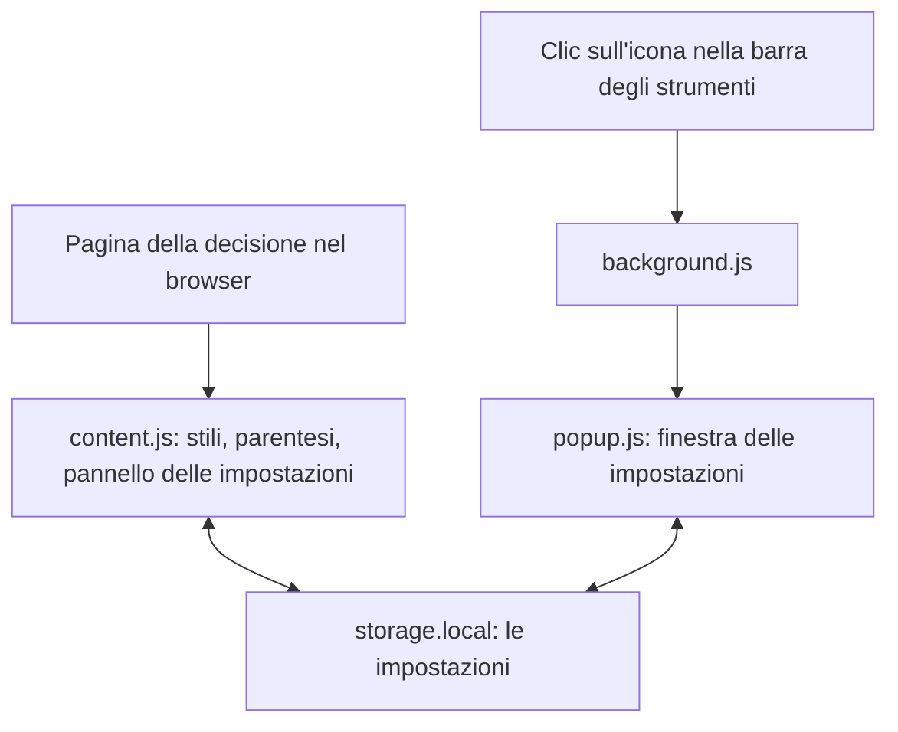
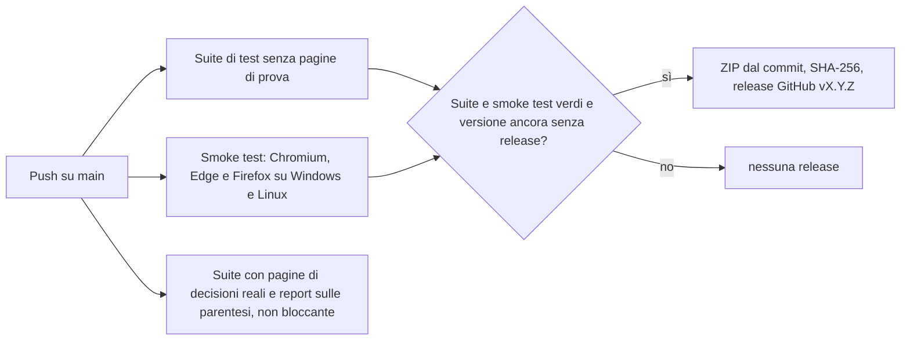

[Deutsch](DE-Entwicklung.md) · [English](EN-Development.md) · [Français](FR-Developpement.md) · **Italiano**

<!-- Non modificare qui nel wiki: la fonte è il file wiki/IT-Sviluppo.md nel repository e il workflow sovrascrive il wiki a ogni push. La pagina tedesca wiki/DE-Entwicklung.md è quella di riferimento: apportare prima lì le modifiche di contenuto, poi riportarle in questa traduzione. -->

Questa pagina si rivolge a chi desidera capire, verificare o contribuire al codice di bger reader. Descrive la struttura del repository, il funzionamento dell'estensione, i test, la gestione delle versioni e il percorso dal commit al pacchetto pubblicato. La versione breve vincolante delle regole di lavoro sono i file `CLAUDE.md` e `STARTPROMPT.md` nel repository.

## Principi

bger reader è volutamente mantenuto piccolo: circa 2000 righe di JavaScript ordinario, distribuite su pochi file, senza framework, senza strumenti di build e senza dipendenze nel pacchetto distribuito. Ciò che si trova nel repository è esattamente ciò che il browser esegue. L'estensione segue l'attuale standard per le estensioni dei browser (Manifest V3) e funziona con un unico codice su Chrome, Brave, Edge e Firefox. Lavora completamente offline. Per lo sviluppo esistono esattamente tre dipendenze di test, che non entrano mai nel pacchetto: jsdom per la suite di test, Playwright e Selenium per lo smoke test nel browser. Ulteriori dipendenze non sono desiderate.

## Struttura del repository

| Percorso | Contenuto |
|---|---|
| `extension/manifest.json` | Manifest V3 dell'estensione, unico punto con il numero di versione |
| `extension/content.js` | Il cuore: motore delle parentesi, stili, profili dei siti, pannello delle impostazioni, memoria, sincronizzazione in tempo reale; tutto in un unico file |
| `extension/background.js` | Script in background: al clic sull'icona apre la finestra delle impostazioni |
| `extension/popup.html`, `popup.css`, `popup.js` | La finestra delle impostazioni con gli stessi elementi di comando del pannello sulla pagina |
| `extension/fonts/` | I caratteri forniti come WOFF2 con le licenze |
| `extension/icons/` | Icona dell'estensione in tre dimensioni, attestazione di licenza delle icone di riga |
| `test/test-runner.js` | Suite di test senza framework, otto blocchi numerati |
| `test/render-check.js` | Genera screenshot delle pagine di prova in tutti gli schemi di colori per il controllo visivo |
| `test/browser-smoke.js` | Smoke test dell'estensione finita in Chromium, Edge e Firefox reali |
| `test/browser-umgebung.js` | Base comune per smoke test e screenshot: server locale che serve le pagine di prova sotto i loro veri nomi host, e un adattatore per Chromium, Edge e Firefox |
| `test/fixtures/` | Pagine di decisioni reali per i test; non nel repository, vengono scaricate tramite script |
| `tools/fetch-fixtures.sh` | Scarica le pagine di prova e il CSS dei siti dei tribunali |
| `tools/klammern-report.js` | Elenca ogni parentesi delle pagine di prova con decisione e motivazione |
| `tools/version.js` | Mostra o incrementa la versione e crea la voce nella cronologia delle modifiche |
| `tools/release.sh` | Costruisce il pacchetto `dist/bger-reader-<Version>.zip` e verifica test, dimensione e somma di controllo |
| `tools/screenshots.js` | Genera le immagini per store e documentazione, circa 30 scene per browser, con didascalie in una `GALERIE.md` |
| `tools/subset-fonts.py` | Genera i caratteri WOFF2 in modo riproducibile dai file originali |
| `.github/workflows/tests.yml` | Test automatici a ogni push e la release da `main` |
| `.github/workflows/wiki.yml` | Copia la cartella `wiki/` nel wiki di GitHub |
| `wiki/` | Le pagine di questo wiki come file Markdown |
| `CHANGELOG.md` | Cronologia delle modifiche; la sezione della versione attuale diventa la nota di release |
| `CLAUDE.md`, `STARTPROMPT.md`, `SYSTEMPROMPT.md` | Regole di lavoro e prompt iniziale per il lavoro con un assistente IA |
| `SECURITY.md`, `LICENSE` | Canale di segnalazione per problemi di sicurezza, licenza |

## Come lavora l'estensione

L'estensione è composta da tre parti, collegate tra loro attraverso la memoria locale per le estensioni del browser. Lo script di contenuto `content.js` viene avviato dal browser su ogni pagina di decisione e vi svolge il lavoro vero e proprio. Lo script in background `background.js` reagisce solo al clic sull'icona nella barra degli strumenti e apre la finestra delle impostazioni. La finestra stessa, `popup.html` con `popup.js`, scrive le proprie impostazioni nella stessa memoria dello script di contenuto. Poiché il browser notifica ogni modifica nella memoria a tutte le parti, le impostazioni fatte nella finestra agiscono subito sulla pagina e viceversa, senza che le parti comunichino direttamente tra loro e senza autorizzazioni aggiuntive.



Sulla pagina della decisione `content.js` carica prima le impostazioni salvate. Solo dopo vengono applicati gli stili, elaborate le parentesi, riempito il pannello delle impostazioni e collegati gli elementi di comando; un clic prima del caricamento potrebbe altrimenti sovrascrivere i valori salvati con quelli predefiniti. Gli stili non vengono impostati elemento per elemento, ma come variabili CSS e poche classi sull'elemento radice della pagina; un foglio di stile inserito una sola volta, con regole `!important`, li traduce in carattere, colori e spaziature dei paragrafi della decisione. Le regole che potrebbero modificare il layout (larghezza del testo, lunghezza delle righe, allineamento, spaziatura dei paragrafi, colonne) vengono attivate solo se l'impostazione si discosta dal valore predefinito; con i valori predefiniti la pagina resta identica al pixel.

Il pannello delle impostazioni vive in uno Shadow DOM, un'area isolata della pagina: il CSS del sito del tribunale non può deformare il pannello, e il CSS del pannello non tocca la pagina. Le icone accanto alle impostazioni sono incorporate come SVG inline; provengono dal tema di icone Colibre di LibreOffice (CC0) e si trovano come stringhe identiche sia in `content.js` sia in `popup.html`, cosa che un blocco di test garantisce, perché non esiste un passaggio di build che possa unificarle.

Nell'uso si distinguono tre percorsi in base al costo. Le modifiche a carattere e colori impostano solo variabili CSS e agiscono subito a ogni movimento del cursore. L'attivazione e la disattivazione della modalità di lettura o delle parentesi ricostruiscono inoltre gli involucri delle parentesi, il che è nettamente più costoso, ma necessario solo in quel caso. Il salvataggio viene raggruppato durante il trascinamento di un cursore (al massimo ogni 0,4 secondi); selezioni, caselle e il rilascio di un cursore salvano subito. La memoria notifica ogni modifica anche alla pagina che l'ha scritta; questa eco viene riconosciuta dal pacchetto scritto e ignorata, altrimenti l'eco di una scrittura precedente riporterebbe indietro un'impostazione più recente.

Il motore delle parentesi è costruito come modulo a sé `BGerReader` all'inizio di `content.js` ed è raggiungibile per i test tramite `window.BGerReader`. Per ogni paragrafo costruisce una mappa di tutti i nodi di testo, trova le parentesi con uno stack (sicuro contro l'annidamento), decide con le regole descritte in [Comprimere le parentesi](IT-Parentesi.md) e avvolge le corrispondenze tramite un intervallo DOM (Range), in modo che link e formattazioni restino conservati. Le regole stesse si trovano come costanti `POLITIK` all'inizio del nucleo delle regole; `BGerReader.begruendung()` spiega per ogni testo di parentesi perché viene compresso o resta aperto.

Per `bvger.weblaw.ch` esiste un profilo di sito dedicato. Poiché il sito è un'app React che carica la decisione in un secondo momento e la sostituisce durante la navigazione senza ricaricare la pagina, `content.js` osserva lì l'albero della pagina con un MutationObserver, limitato da un timer di 150 millisecondi, e ricostruisce stili e parentesi solo se il blocco di testo è effettivamente cambiato. Il blocco di testo viene riconosciuto come il figlio del segmento della decisione con il maggior numero di paragrafi e riceve a runtime la classe `bkl-text`; la lingua viene riconosciuta dal rubrum (intestazione della decisione) e impostata per la sillabazione.

## Configurare l'ambiente di sviluppo

Servono Git, Node.js (versione 22 o più recente) e `curl`. Un clone nuovo è pronto all'uso in quattro comandi; le pagine di prova (fixture) vengono scaricate dai siti dei tribunali e volutamente non sono nel repository, perché sono grandi e contengono materiale di terzi.

```
git clone https://github.com/cursorblinkrate-boop/bger-reader-addon.git
cd bger-reader-addon
bash tools/fetch-fixtures.sh
cd test && npm install --no-save jsdom@30.1.0 && node test-runner.js
```

Ci si aspetta come ultima riga «0 fehlgeschlagen» (0 falliti). Il numero totale delle verifiche cresce con ogni nuovo test e volutamente non è fissato da nessuna parte; l'unico criterio è che nulla fallisca. Senza pagine di prova il blocco [3] viene saltato. Per lo smoke test nel browser si aggiungono Playwright e Selenium; poiché nella cartella `test` volutamente non c'è alcun `package.json`, `npm install` rimuove i pacchetti non indicati, quindi installare sempre tutti insieme:

```
cd test && npm install --no-save jsdom@30.1.0 playwright@1.56.1 selenium-webdriver@4.49.0
(cd test && npx playwright install chromium)
node test/browser-smoke.js chromium
node test/browser-smoke.js edge
node test/browser-smoke.js firefox
node tools/screenshots.js chromium
```

Edge usa il Microsoft Edge installato sul computer e non richiede alcun download; Firefox e il driver adatto li scarica Selenium da sé quando necessario. L'ultimo comando genera le immagini per store e documentazione, a scelta anche con `edge` o `firefox`.

Per provare nel proprio browser, la cartella `extension/` viene caricata direttamente come estensione non pacchettizzata, come descritto in [Installazione](IT-Installazione.md); dopo ogni modifica bastano un clic su «Aggiorna» sulla pagina delle estensioni e un ricaricamento della pagina della decisione.

## Test

La suite di test in `test/test-runner.js` fa a meno di un framework di test: una piccola funzione `pruefe()` conta le verifiche superate e fallite, e jsdom fornisce un albero di pagina del browser senza browser. La suite è volutamente compatta, un test per ogni aspetto, e i fallimenti indicano i casi interessati nel testo di dettaglio. I blocchi sono numerati:

| Blocco | Cosa viene verificato |
|---|---|
| [1] Regole di compressione | Un corpus di circa 120 parentesi in sei categorie contro le regole, valutato per categoria |
| [2] Compressione nel DOM | Costruire e rimuovere gli involucri, andata e ritorno esatti al carattere, barre di cambio pagina, parentesi annidate |
| [3] Pagine di decisioni reali | Le pagine di prova scaricate: paragrafi trovati, parentesi elaborate, nulla perso; viene saltato senza pagine di prova |
| [4] Pannello e stili | Etichette conformi al progetto, variabili CSS, neutralità rispetto al layout, schemi di colori, icone |
| [5] Memoria e sincronizzazione in tempo reale | Caricamento, salvataggio, raggruppamento, riconoscimento dell'eco, uso solo dopo il caricamento |
| [6] Pacchetto | Manifest, versione rispetto alla cronologia delle modifiche, file dei caratteri consentiti |
| [7] Finestra pop-up | La finestra ha gli stessi elementi di comando, icone e regole di anteprima del pannello sulla pagina |
| [8] bvger.weblaw.ch | Caricamento successivo, sostituzione, navigazione senza ricaricamento, riconoscimento della lingua, colonne e larghezza del testo |

`test/render-check.js` genera inoltre screenshot delle pagine di prova in tutti e cinque gli schemi di colori; lo script è pensato per il controllo visivo dopo modifiche al pannello o al CSS e presuppone un Chrome installato localmente. `test/browser-smoke.js` verifica l'estensione finita in un Chromium reale (che vale per Chrome e Brave), in Microsoft Edge e in Firefox: integrazione tramite il manifest sull'indirizzo reale, interazione con il CSS del sito del tribunale, caratteri forniti, salvataggio attraverso un ricaricamento, sincronizzazione in tempo reale tra finestra e pagina, vista di stampa. Poiché `search.bger.ch` si trova dietro una protezione anti-bot che ai browser automatizzati presenta una pagina captcha, un server locale da `test/browser-umgebung.js` serve le pagine di prova sotto i loro veri nomi host, e lo stesso componente fornisce l'adattatore unificato per i tre browser; solo `bvger.weblaw.ch` viene caricato dal vivo e, se irraggiungibile, saltato con un avviso. Gli screenshot finiscono in `test/smoke/<browser>/` e vanno guardati, non solo contati.

`tools/screenshots.js` usa lo stesso ambiente per generare le immagini per gli store dei browser e la documentazione: circa 30 scene per browser con ogni carattere, ogni sfondo e ogni impostazione, la finestra delle impostazioni, panoramiche su una o due schermate e la vista di stampa, nel formato degli store di 1280 per 800 pixel. Viene inoltre creata una `GALERIE.md` con una didascalia per ogni immagine, come modello per README e testi degli store. Nella verifica automatica le immagini sono allegate a ogni esecuzione come artefatto `screenshots-<os>-<browser>`.

`tools/klammern-report.js` è lo strumento per il tasso di riconoscimento delle regole sulle parentesi: elenca, per le pagine di prova, ogni parentesi con la decisione e la motivazione. Se una riga non è corretta, quello è esattamente il caso che appartiene come caso di test al blocco [1]. Il report viene generato anche nella verifica automatica e vi è allegato come artefatto scaricabile.

## Versione e cronologia delle modifiche

Il numero di versione si trova in un unico punto, in `extension/manifest.json`, e non viene mai modificato a mano. Ogni modifica visibile all'utente incrementa la versione con `node tools/version.js patch` (correzione), `minor` (nuova funzione) o `major` (ristrutturazione) secondo il [Semantic Versioning](https://semver.org/lang/it/). Lo strumento crea contemporaneamente in cima a `CHANGELOG.md` una voce con una riga TODO, che prima del push viene sostituita dalla descrizione della modifica; il blocco di test [6] verifica che manifest e cronologia coincidano. Le modifiche che riguardano solo test o strumenti non incrementano la versione.

## Dal commit alla release

A ogni push GitHub Actions esegue i test. L'esecuzione obbligatoria della suite fa a meno delle pagine di prova, per non dipendere dalla raggiungibilità dei siti dei tribunali. Una seconda esecuzione con le pagine di decisioni reali e il report sulle parentesi è preziosa, ma non bloccante, perché può diventare rossa in caso di modifica all'HTML del sito del tribunale. Lo smoke test nel browser gira su Windows e Linux, ciascuno in Chromium, Edge e Firefox, e allega a ogni esecuzione i propri screenshot come artefatti; in seguito `tools/screenshots.js` genera le immagini per store e documentazione come ulteriore artefatto, senza che un'immagine mancante possa bloccare la release.



Se, a un push su `main`, suite e smoke test sono verdi e la versione nel manifest non ha ancora una release, il pacchetto nasce direttamente dal commit con `git archive`. È riproducibile: stesso commit, stessi byte, stessa somma di controllo, ricostruibile anche in locale, e avviene senza installazione npm nell'unico job che ha diritti di scrittura, così che un pacchetto manipolato proveniente da una dipendenza non potrebbe nemmeno entrare nella release. Accanto allo ZIP viene pubblicata la somma di controllo SHA-256 come file separato, e la sezione della versione da `CHANGELOG.md` diventa la nota di release. La pagina delle release è l'unico luogo di download del pacchetto; in locale `bash tools/release.sh` costruisce lo stesso pacchetto a scopo di controllo, verifica prima la suite e poi la dimensione (al massimo 1023 KB, attualmente circa 250 KB).

## Regole di lavoro

Il progetto è curato da una sola persona e sviluppato in gran parte con un assistente IA (Claude Code); `CLAUDE.md` e `STARTPROMPT.md` sono le istruzioni a tale scopo e al tempo stesso la descrizione più concisa delle regole del gioco. Le più importanti: le modifiche vanno direttamente su `main`, senza feature branch e senza pull request. Prima di ogni push la suite completa deve girare senza fallimenti, in caso di modifiche al pannello o al CSS in aggiunta il controllo visivo tramite screenshot, e prima di un caricamento nello store si guardano le immagini dell'esecuzione CI, non solo il segno di spunta verde. Nuovi test vengono scritti solo se garantiscono una modifica concreta, e la suite deve restare piccola. I messaggi di commit sono in tedesco: una riga breve, una riga vuota, poi punti elenco con la motivazione e un'indicazione su come la modifica è stata verificata. Nuove dipendenze, Docker o ambienti aggiuntivi non sono desiderati. Le icone SVG per il pannello hanno un'area di disegno di 16 per 16, spessore del tratto da 1.5 a 1.6 e si colorano tramite `currentColor`.

## Manutenzione del wiki e della documentazione

Le pagine di questo wiki si trovano come file Markdown nella cartella `wiki/` del repository e da lì vengono copiate nel wiki di GitHub dal workflow `.github/workflows/wiki.yml` a ogni push su `main` che tocca la cartella. Le modifiche alla documentazione si fanno perciò come le modifiche al codice: modificare il file in `wiki/`, fare il commit, fare il push. Le modifiche fatte direttamente nel wiki tramite il suo pulsante di modifica vengono sovrascritte alla successiva esecuzione.

Il wiki esiste in quattro lingue. Ogni pagina esiste quattro volte, e il nome del file inizia con la sigla della lingua: `DE-Installation.md`, `EN-Installation.md`, `FR-Installation.md`, `IT-Installazione.md`. `Home.md` è la scelta della lingua, su cui atterra ogni wiki, e la prima riga di ogni pagina è la barra delle lingue con i link alla stessa pagina nelle altre tre lingue. La versione tedesca è la fonte: le modifiche di contenuto vengono fatte prima lì e poi riportate nelle traduzioni, affinché le quattro versioni non divergano. L'interfaccia dell'estensione stessa è solo in tedesco; le traduzioni riportano perciò ogni etichetta nella formulazione tedesca e la spiegano nella rispettiva lingua.

I link tra le pagine vengono scritti nei file con l'estensione del file, per esempio `IT-Installazione.md`, affinché funzionino anche nel repository; il workflow rimuove il suffisso durante la copia, perché il wiki indirizza le pagine senza suffisso. I nomi dei file restano senza dieresi, accenti e spazi, perché diventano l'indirizzo della pagina. `_Sidebar.md` è la navigazione, `_Footer.md` il piè di pagina, e `wiki/README.md` descrive la cartella con la tabella dei nomi di tutte le pagine, senza essere esso stesso una pagina del wiki. Il wiki deve essere attivato una volta nelle impostazioni del repository e creato con una prima pagina; fino ad allora il workflow termina con un avviso invece che con un errore.

## Origini

Il progetto è iniziato come userscript per Tampermonkey, congelato con la versione 2.1.0 e conservato nel tag Git `userscript-2.1.0`. Con la versione 0.2.0 è diventato un'estensione secondo Manifest V3; la numerazione è ripartita da capo. Il vecchio script non serve da modello; le modifiche avvengono ormai solo in `extension/content.js`.
